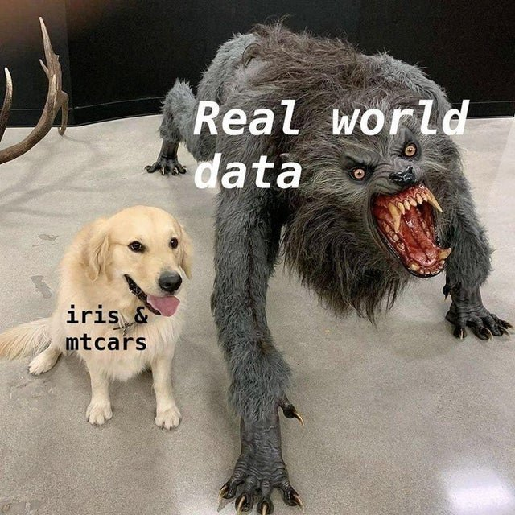
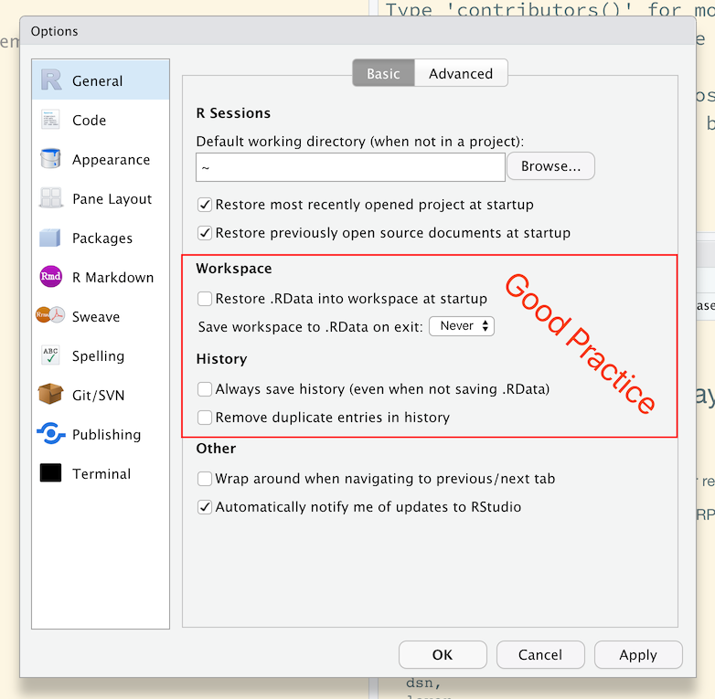
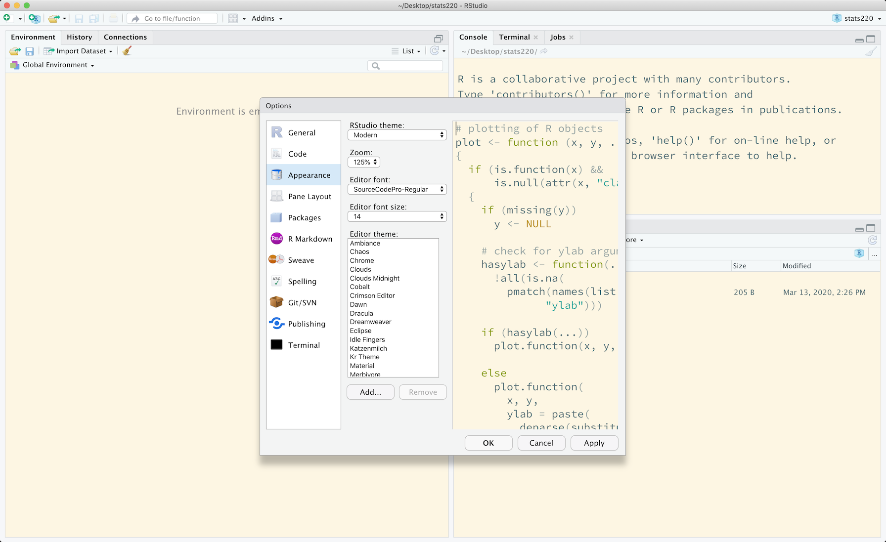
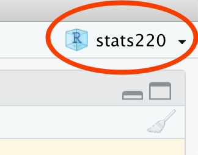
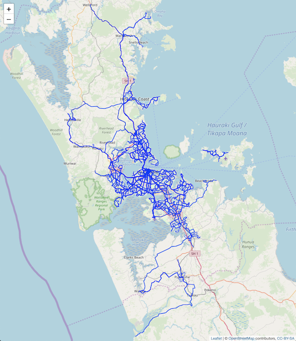

```{r initial, echo = FALSE, cache = FALSE, results = 'hide'}
library(knitr)
options(htmltools.dir.version = FALSE, tibble.width = 60, tibble.print_min = 6)
opts_chunk$set(
  echo = TRUE, warning = FALSE, message = FALSE, comment = "#>",
  fig.path = 'figure/', cache.path = 'cache/', cache = TRUE,
  fig.align = 'center', fig.width = 12, fig.height = 8.5, fig.show = 'hold',
  dpi = 120
)
```

```{r xaringan-panelset, echo = FALSE}
xaringanExtra::use_panelset()
```

```{r external, include = FALSE, cache = FALSE}
read_chunk('R/07-intro-r.R')
```

## Kia Ora!

.large[
* `r emo::ji("mortar_board")` I earned my PhD (Stats) @ Monash University, Australia.
* `r emo::ji("heart")` My research interests lie in exploratory data analysis, data visualisation, software design, ...
* `r emo::ji("woman_technologist")` I turn `r emo::ji("coffee")` into 10 `#rstats` `r emo::ji("package")`.
* Outside of work, I play `r emo::ji("tennis")` & `r emo::ji("ping_pong")`, and make `r emo::ji("coffee")`.
]

.center[
[](https://tsibble.tidyverts.org)
[](https://pkg.earo.me/hts)
]

---

class: inverse middle center

## Data + Technology

---

## What I mean by "data"

--

```{r iris-mtcars-meme, echo = FALSE, out.width = "65%"}

```

???

How many of you have seen and worked with datasets, such as *iris*, *mtcars*, *wages*?

---

## How I learn about XX "technology"

.center[
<iframe src="https://giphy.com/embed/xonOzxf2M8hNu" width="480" height="270" frameBorder="0" class="giphy-embed" allowFullScreen></iframe><p><a href="https://giphy.com/gifs/xonOzxf2M8hNu"></a></p>
]
* `r emo::ji("speaking_head")` **Get hands dirty**`r emo::ji("bangbang")`
* Documentation! Documentation! Documentation!
* Search or ask questions on [Stack Overflow](http://stackoverflow.com) and [RStudio Community](http://community.rstudio.com)
* Follow the community, [#rstats](https://twitter.com/search?q=%23rstats&src=typeahead_click) on Twitter
* (Not surprisingly) Learn to google: what that error message means (I google a lot `r emo::ji("hand_over_mouth")`)

---

class: inverse middle

## .center[Why <i class='fab fa-r-project'></i>]

* A general-purpose of programming language
* Originated by statisticians, a language for statistical computing and graphics
* 15,000 + packages on [CRAN](https://cran.r-project.org/web/packages/) (Comprehensive R Archive Network, the official repository), Github, and others
* The tidyverse, a domain specific language in R for data scientists

---

.left-column[
## What R can do?
### - for fun
]
.right-column[
### `r emo::ji("package")` `memer` for creating memes
```{r memer, out.width = "80%"}
```
]

---

.left-column[
## What R can do?
### - for fun
### - for data
]
.right-column[
### The data science workflow

.center[

[](https://readr.tidyverse.org)
[](https://tidyr.tidyverse.org)
[](https://dplyr.tidyverse.org)
[](https://ggplot2.tidyverse.org)
[](https://purrr.tidyverse.org)
]

.footnote[image credit: [The Tidyverse Cookbook](https://rstudio-education.github.io/tidyverse-cookbook/how-to-use-this-book.html)]
]

---

.left-column[
## What R can do?
### - for fun
### - for data
### - for writing
]
.right-column[
### R Markdown

.center[
[](https://rmarkdown.rstudio.com)
[](https://bookdown.org/yihui/blogdown/)
[](http://bookdown.org)
[](http://slides.yihui.org/xaringan/)
]

* `rmarkdown` for assignments/reports/paper in `.html` and `.pdf`
* `blogdown` for blogs
* `bookdown` for books
* `xaringan` for slides

<hr>

.checked[
* R Markdown documents are fully reproducible: weaving narrative text and code together.
* You can leverage them with the HTML and CSS you learned to make your own style.
]
]

---

class: middle

## Why RStudio

> If R were an airplane, RStudio would be the airport, providing many, many supporting services that make it easier for you, the pilot, to take off and go to awesome places. Sure, you can fly an airplane without an airport, but having those runways and supporting infrastructure is a game-changer. <br> -- [Julie Lowndes](http://jules32.github.io/resources/RStudio_intro/)


---

## RStudio interface


.footnote[image credit: [Stuart Lee's handout on **Setting up R and RStudio**](https://mida-monash.netlify.com/slides/setup.html)]

---

## Setting up RStudio

Go to **Tools** > **Global Options**:

.center[]

This helps to keep R working environment fresh and clean every time you switch between projects.

---

## Your turn

Change the RStudio appearance up to your taste

.center[]

`r countdown::countdown(minutes = 1, font_size = "48px", top = 0)`

???

1 minutes to choose your favourite theme

---

## Project-oriented workflow

* Each data analysis/university course is a project, and get your work organised.
* A self-contained project is a folder `r emo::ji("folder")` that contains all relevant files.
* All working files are relative to the project root.
* The project should just work on a different computer.
* Jenny Bryan will [set your computer on fire `r emo::ji("fire")`](https://www.tidyverse.org/blog/2017/12/workflow-vs-script/)
  + if the first line of your R script is
    ```r
      setwd("C:\Users\jenny\path\that\only\I\have")
    ```
  + if the first line of your R script is
    ```r
      rm(list = ls())
    ```

---

## RStudio project `.Rproj`

.pull-left[
1. Click the **Project** icon on the top right corner 
<br>
<br>
<br>
<br>
<br>
2. **New Directory**/**Existing Directory** > **New Project** > **Create Project**
<br>
<br>
<br>
3. Open the project
]
.pull-right[
.center[



]
]

---

## Project structure

Under the `stats220` directory:

.pull-left[
.x[
* `01-clean-data.R`
* `02-analyse-data.R`
* `assignment1.Rmd`
* `assignment2.Rmd`
* `bus_route.xlsx`
* `lab1.Rmd`
* `titanic.csv`
]
]
.pull-right[
* `data/`:
  * `titanic.csv`
  * `bus_route.xlsx`
* `assignments/`:
  * `assignment1.Rmd`
  * `assignment2.Rmd`
* `labs/`:
  * `lab1.Rmd`
* `R/`
  * `01-clean-data.R`
  * `02-analyse-data.R`
]

---

class: inverse middle

## <i class='fab fa-r-project'></i> as general-purpose programming language

---

.left-column[
## R basics
### - access to RAM
]
.right-column[
Store values temporarily in computer memory

```{r store-values}
```
`r emo::ji("arrow_up")` read as `akl_lon` gets (`<-`) the value of `174.76`.

An .red[assignment] consists of:
* left-hand side: .red[variable names] or .red[symbols] starts with a letter.
  .checked[+ `akl_lon` (`snake_case` convention)]
  .x[+ `akl.lon` & `aklLon` (not recommended)]
* assignment operator:
  .checked[+ `<-`]
  .x[+ `=` & `->`: `174.76 -> akl_lon`]
* right-hand side: .red[values]
]

---

.left-column[
## R basics
### - access to RAM
]
.right-column[
Retrieve values from computer memory

```{r retrieve-values}
```

Names are case senstive
```{r retrieve-error, error = TRUE}
```
]

---

.left-column[
## R basics
### - access to RAM
### - access to CPU
]
.right-column[
Perform operations or calculations like arithmetic and comparisons

```{r arithmetic}
```
]

---

.left-column[
## R basics
### - access to RAM
### - access to CPU
### - access to mass storage
]
.right-column[
Read data files from hard distks, USB sticks, etc into RAM

```{r mass-storage}
```
]


---

.left-column[
## R basics
### - access to RAM
### - access to CPU
### - access to mass storage
### - access to screen
]
.right-column[
Print out results
```{r mass-storage-print}
```
]

---

.left-column[
## R basics
### - access to RAM
### - access to CPU
### - access to mass storage
### - access to screen
]
.right-column[
Produce visual displays

```{r screen, out.width = "100%"}
```
]

---

.left-column[
## R basics
### - access to RAM
### - access to CPU
### - access to mass storage
### - access to screen
### - access to network
]
.right-column[
Access data from remote computers, including web servers on the internet

.panelset[
.panel[.panel-name[R Code]

```{r network, eval = FALSE}
```

A sequence of function calls
]

.panel[.panel-name[Map]

```{r network2, echo = FALSE, out.width = "60%"}

```
]
]
]

---

class: inverse middle

## R has its own syntax and semantics, like other languages.

---

## Syntactic names

---

## Atomic vectors

---

## Functions

A function call consists of the function name followed by one or more argument within parentheses.

```r
st_read("data/Bus_Route/Bus_Route.shp")
```

* function name: `st_read()` from the **sf** package to read geo-spatial data
* argument/input: `"data/Bus_Route/Bus_Route.shp"` its first argument to specify the data source in characters

<hr>

Consult the function's help page with `?st_read`
