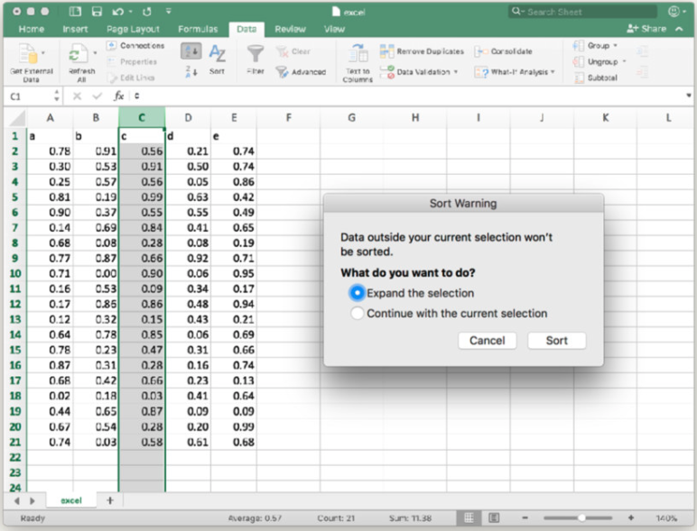
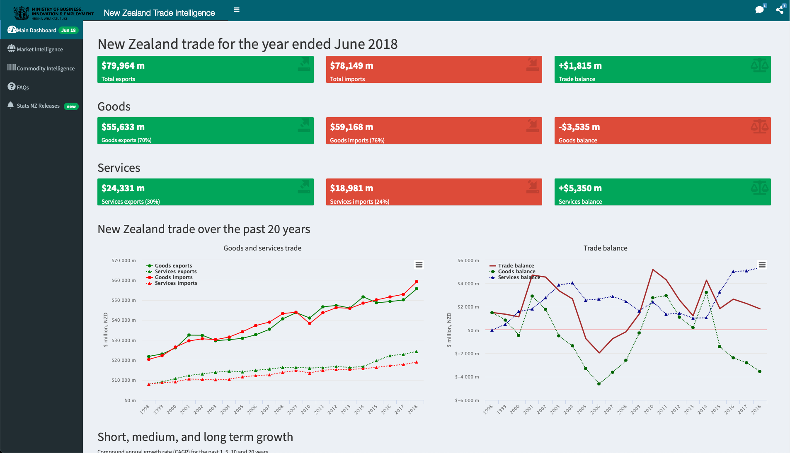
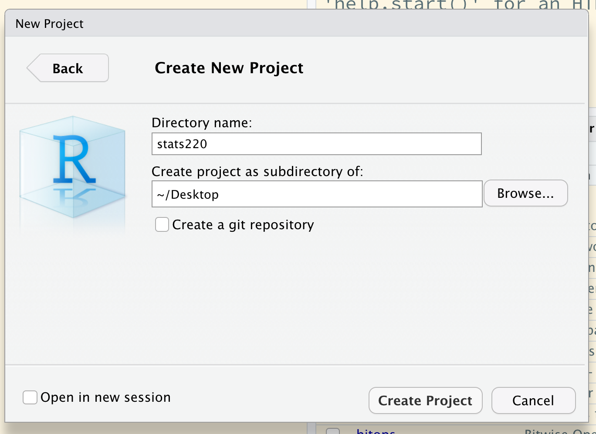

class: middle

```{r initial, echo = FALSE, cache = FALSE, results = 'hide'}
library(knitr)
options(htmltools.dir.version = FALSE, htmltools.preserve.raw = FALSE, 
  tibble.width = 60, tibble.print_min = 6)
opts_chunk$set(
  echo = TRUE, warning = FALSE, message = FALSE, comment = "#>",
  fig.path = 'figure/', cache.path = 'cache/', cache = TRUE,
  fig.align = 'center', fig.width = 12, fig.height = 8.5, fig.show = 'hold',
  dpi = 120
)
```

```{r xaringan-panelset, echo = FALSE}
xaringanExtra::use_panelset()
```

```{r external, include = FALSE, cache = FALSE}
read_chunk('R/01-intro.R')
```

## Kia Ora!

.large[
* `r emo::ji("mortar_board")` I earned my PhD (Stats) @ Monash University, Australia.
* `r emo::ji("heart")` My research interests lie in exploratory data analysis, data visualisation, software design, ...
* `r emo::ji("woman_technologist")` I turn `r emo::ji("coffee")` into > 10 `#rstats` `r emo::ji("package")`.
* Outside of work, I play `r emo::ji("tennis")` and make `r emo::ji("coffee")`.
]

---

class: middle

.pull-left[
]
.pull-right[
## Contact
* `r emo::ji("email")` <earo.wang@auckland.ac.nz>
* `r emo::ji("pushpin")` Office 303.323
* `r emo::ji("clock12")` Thursday 2-3pm
]

---

class: inverse middle center

## Data + Technology

### <i class="fas fa-arrow-circle-right"></i> <https://stats220.earo.me>

???

* revamped
* all course materials available on this website
* except for some big datasets
* turn your labs/assignments on canvas

---

## What I mean by "data"

<!--
.center[]
-->

.pull-left[
<br>
## .center[.large[.large[.large[`r emo::ji("canned_food")`]]]]
.x[
* Stale, uninteresting, convenient 
* Highly processed and archived
* Example: `student tests`, `titanic`, `wages`
]
]
.pull-right[
<br>
## .center[.large[.large[.large[`r emo::ji("tomato")`]]]]
.checked[
* Fresh, interesting, challenging 
* Locally collected and impactful
* Example: [Auckland realtime transport](https://dev-portal.at.govt.nz)
]
]

???

How many of you have seen and worked with datasets, such as *iris*, *mtcars*, *wages*?

---

## How I learn about XX "technology"

.center[
<iframe src="https://giphy.com/embed/xonOzxf2M8hNu" width="480" height="270" frameBorder="0" class="giphy-embed" allowFullScreen></iframe><p><a href="https://giphy.com/gifs/xonOzxf2M8hNu"></a></p>
]
* `r emo::ji("speaking_head")` **Get hands dirty**`r emo::ji("bangbang")`
* `r emo::ji("open_book")` Documentation! Documentation! Documentation!
* `r emo::ji("search")` (Not surprisingly) Learn to google: what that error message means (I google a lot `r emo::ji("hand_over_mouth")`)

???

* Search or ask questions on [Stack Overflow](http://stackoverflow.com) and [RStudio Community](http://community.rstudio.com)
* Follow the community, [#rstats](https://twitter.com/search?q=%23rstats&src=typeahead_click) on Twitter

---

class: inverse middle center

# You can't do data science in a GUI



.footnote[reference: [You can't do data science in a GUI](https://speakerdeck.com/hadley/you-cant-do-data-science-in-a-gui)]

---

## Why programme for data science?

* Programming languages are **languages**.
```{r eval = FALSE}
starwars %>%
  group_by(species) %>%
  summarise(
    n = n(),
    mass = mean(mass, na.rm = TRUE)
  ) %>%
  filter(n > 1, mass > 50)
```
* It's just .red[**text**]!
  + reproducible, readable, sharable
  + expressive

---

class: inverse middle

## .center[Why <i class='fab fa-r-project'></i>]

* A general-purpose of programming language
* Originated by statisticians, a language for statistical computing and graphics
* 15,000 + packages on [CRAN](https://cran.r-project.org/web/packages/) (Comprehensive R Archive Network, the official repository), Github, etc.
* The [tidyverse](http://tidyverse.org), a domain specific language in R for data scientists

???

3rd party packages thriving

---

.left-column[
## What R can do?
### - for fun
]
.right-column[
### `r emo::ji("package")` {cowsay} for generating ASCII picture
```{r cowsay}
```
]

---

.left-column[
## What R can do?
### - for fun
### - for data
]
.right-column[
### The data science workflow

.center[

[](https://tidyverse.org)
<i class="fas fa-equals"></i>
[](https://readr.tidyverse.org)
[](https://tidyr.tidyverse.org)
[](https://dplyr.tidyverse.org)
[](https://ggplot2.tidyverse.org)
[](https://purrr.tidyverse.org)
]

]

---

.left-column[
## What R can do?
### - for fun
### - for data
### - for communication
]
.right-column[
### R Markdown

.center[
[](https://rmarkdown.rstudio.com)
[](https://bookdown.org/yihui/blogdown/)
[](http://bookdown.org)
[](http://slides.yihui.org/xaringan/)
]

* [{rmarkdown}](https://rmarkdown.rstudio.com) for assignments/reports/papers in `.html` and `.pdf`
* [{blogdown}](https://bookdown.org/yihui/blogdown/) for blogs
* [{bookdown}](http://bookdown.org) for books
* [{xaringan}](http://slides.yihui.org/xaringan/) for slides (220 slides!)

<hr>

**R Markdown documents are fully reproducible: weaving narrative text and code together.**
]

???

How many of you have used RMarkdown before?

---

.left-column[
## What R can do?
### - for fun
### - for data
### - for communication
]
.right-column[
### R shiny dashboard

* [Shiny](https://shiny.rstudio.com) is an R package that makes it easy to build interactive web apps straight from R.

.center[
[](https://gallery.shinyapps.io/nz-trade-dash/?_ga=2.23065394.843607630.1613358581-1567280293.1613186793)
]
.small[`r emo::ji("point_up_2")` click the image above will take you to the web app, and try to interact with the app.]
]

---

## Textbook `r emo::ji("books")`

.pull-left[
.center[[](https://r4ds.had.co.nz)]
]
.pull-right[
.center[[](https://adv-r.hadley.nz)]
]

???

* Available online
* clicking images will take you to the book

---

class: middle

.pull-left[
## At first, you may be like this...


]

--

.pull-right[
## But you can do it!

]

---

## Assessments

* Weekly labs 10%
* 3 assignments 30%
* Mid-term test 10% (TBD, possibly week 8)
* Final exam 50%

---

class: inverse center middle

# Project-oriented workflow

---

class: middle


> If R were an airplane, RStudio would be the airport, providing many, many supporting services that make it easier for you, the pilot, to take off and go to awesome places. Sure, you can fly an airplane without an airport, but having those runways and supporting infrastructure is a game-changer. <br> -- [Julie Lowndes](http://jules32.github.io/resources/RStudio_intro/)


---

## RStudio interface

.center[]

.footnote[image credit: [Stuart Lee's handout on **Setting up R and RStudio**](https://mida-monash.netlify.com/slides/setup.html)]

---

## Setting up RStudio (do this once)

.pull-left[
Go to **Tools** > **Global Options**:
.center[]
]
.pull-right[
<br>
<br>
<br>
<br>
Uncheck `Workspace` and `History`, which helps to keep R working environment fresh and clean every time you switch between projects.
]

---

## Your turn

Change the RStudio appearance up to your taste

.center[]

`r countdown::countdown(minutes = 1, font_size = "48px", top = 0)`

???

1 minutes to choose your favourite theme

---

## What is a project?

* Each university course is a project, and get your work organised.
* A self-contained project is a folder that contains all relevant files, for example my `stats220/` `r emo::ji("folder")` includes:
   + `data/`
     + `*.csv`, `*.xlsx`
   + `lectures/`
     + `01-intro.Rmd`, `02-import-export.Rmd`
   + `labs/`
     + `lab01.R`, `lab02.R`
* All working files are relative to the **project root** (i.e. `stats220/`).
* The project should just work on a different computer.

---

## `r emo::ji("stop_sign")` STOP DOING THIS!

[Jenny Bryan](https://jennybryan.org) will [set your computer on fire `r emo::ji("fire")`](https://www.tidyverse.org/blog/2017/12/workflow-vs-script/)
1. if the first line of your R script is
  ```r
    setwd("C:\Users\jenny\path\that\only\I\have")
  ```
2. if the first line of your R script is
  ```r
    rm(list = ls())
  ```

---

background-image: url(https://github.com/allisonhorst/stats-illustrations/raw/master/rstats-artwork/cracked_setwd.png) 
background-size: cover

---

## Create an RStudio project `.Rproj`

.pull-left[
1. Click the **Project** icon on the top right corner 
<br>
<br>
<br>
<br>
2. **New Directory**/**Existing Directory** > **New Project** > **Create Project**
<br>
<br>
<br>
3. Open the project
]
.pull-right[
.center[]
.center[]
.center[]
]

---

class: inverse middle

## <i class='fab fa-r-project'></i> 101: syntax and semantics

---

.left-column[
## Get started
### - assignment
]
.right-column[
```{r store-values}
```
`r emo::ji("arrow_up")` read as "assign the value of `174.76` to an object called `akl_lon`".

An .red[assignment] consists of:
* left-hand side: .red[variable names] or .red[symbols] (`akl_lon`)
* assignment operator: .red[`<-`] (RStudio shortcut: `Alt` + `-`)
* right-hand side: .red[values] (``r akl_lon``)
]

---

.left-column[
## Get started
### - assignment
### - retrieval
]
.right-column[
```{r retrieve-values}
```

* Names are case sensitive.
```{r retrieve-error, error = TRUE}
```
]

---

.left-column[
## Get started
### - assignment
### - retrieval
### - operation
]
.right-column[
### Perform calculations like arithmetic

* Infix operators:
  * `+`, `-`, `*`, `/`, `^`
  * `%%`: modulo
  * `%/%`: integer division

```{r arithmetic}
```
]

---

## Coding style

> Good coding style is like correct punctuation: you can manage without it, butitsuremakesthingseasiertoread.
> <br> -- [The tidyverse style guide](https://style.tidyverse.org)

### R style guide

.pull-left[
.checked[
* `snake_case`
]
]
.pull-right[
.x[
* `camelCase` (Javascript)
* `PascalCase` (Python)
]
]

---

class: inverse middle

## <i class='fab fa-r-project'></i> 101: data structures

---

## Atomic vectors

.pull-left[
.center[]

### Missing values

```r
NA # Not Applicable
c(174.76, NA, -36.85)
```

.footnote[image credit: [Hadley Wickham's **Advanced R**](https://adv-r.hadley.nz/vectors-chap.html#atomic-vectors)]
]
.pull-right[
### Scalars

* Logicals: `TRUE` or `FALSE`
* Doubles: `174.76`, `1.7476e2`, `Inf`, `-Inf`, `NaN` (Not a Number)
* Integers: `174L`
* Strings: `"hello"`, `'world'`

### Vectors

```{r vectors}
```

]

---

## Atomic vectors

.center[]

---

## Subsetting vectors with `[]`
```{r subsetting}
```

.pull-left[
### Positive indices
```{r positive-indices}
```
]
.pull-right[
### Negative indices
```{r negative-indices}
```
]

---

## Subsetting vectors with `[]`

.pull-left[
### Logical indices
```{r logical-indices}
```
]
.pull-right[
### Special subsetting
```{r special-subsetting}
```
]

---

class: inverse middle

## <i class='fab fa-r-project'></i> 101: functions

---

## Function

A function call consists of the .red[function name] followed by one or more .red[argument] within parentheses.

```{r function-mean}
```


* function name: `mean()`, a built-in R function to compute mean of a vector
* argument: the first argument (LHS `x`) to specify the data (RHS `x`)

---

## Function help page

Check the function's help page with `?mean`

```r
mean(x, trim = 0, na.rm = FALSE, ...)
```

* Read **Usage** section
  + What arguments have default values?
* Read **Arguments** section
  + What does `trim` do?
* Run **Example** code

`r countdown::countdown(minutes = 1, font_size = "48px", top = 0)`

---

## Function arguments

.pull-left[
<br>
<br>
<br>
.center[Match by **positions**]
```{r function-args-pos}
```
]
.pull-right[
<br>
<br>
<br>
.center[Match by **names**]
```{r function-args-names}
```
]

---

## Use functions from packages

.pull-left[
```{r cummean}
```
]
.pull-right[
<br>
<br>
<br>
.center[

]
]

---

## Write your own functions

```{r custom-mean}
```

---

## Reading

.pull-left[
.center[[](https://r4ds.had.co.nz)]
* [Workflow: basics](https://r4ds.had.co.nz/workflow-basics.html)
* [Workflow: scripts](https://r4ds.had.co.nz/workflow-scripts.html)
* [Workflow: project](https://r4ds.had.co.nz/workflow-projects.html)
]
.pull-right[
.center[[](https://adv-r.hadley.nz)]
* [Names and values](https://adv-r.hadley.nz/names-values.html)
* [Vectors](https://adv-r.hadley.nz/vectors-chap.html)
* [Subsetting](https://adv-r.hadley.nz/subsetting.html)
]
