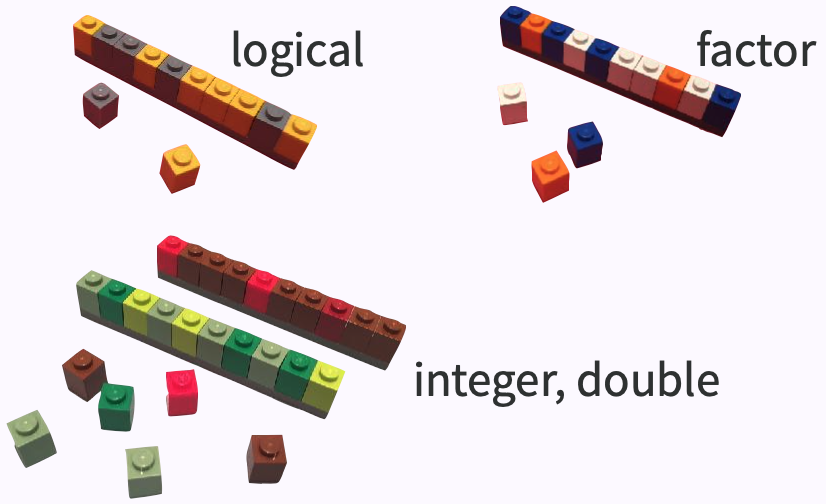
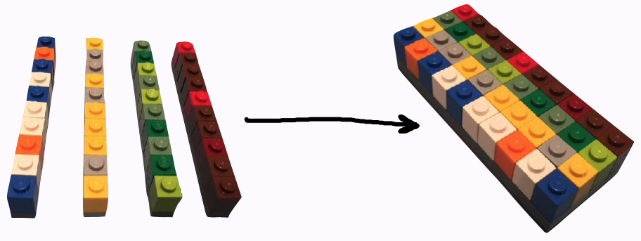
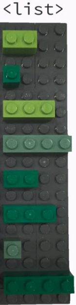

```{r initial, echo = FALSE, cache = FALSE, results = 'hide'}
library(knitr)
options(htmltools.dir.version = FALSE, tibble.width = 60, tibble.print_min = 6)
opts_chunk$set(
  echo = TRUE, warning = FALSE, message = FALSE, comment = "#>",
  fig.path = 'figure/', cache.path = 'cache/', cache = TRUE,
  fig.align = 'center', fig.width = 12, fig.height = 8.5, fig.show = 'hold',
  dpi = 120
)
```

```{r xaringan-panelset, echo = FALSE}
xaringanExtra::use_panelset()
```

```{r external, include = FALSE, cache = FALSE}
read_chunk('R/02-import-export.R')
```

## Atomic vector (1d)

.center[]

```{r vector}
```

.footnote[image credit: Jenny Bryan]

???

* an ensemble of scalars -> vectors

---

## 1d `r emo::ji("arrow_right")` 2d 

.pull-left[
<br>
<br>
<br>
.center[]
]
.pull-right[
```{r tibbles}
```
]

.footnote[image credit: Jenny Bryan]


???

* an ensemble of vectors -> rect data/tabular data, like spreadsheet

---

class: inverse middle

## Beyond 1d vectors

### 1. Lists

### 2. Matrices and arrays

### 3. Data frames and tibbles

???

* Common data strs beyond 1d
* start with the most flex one
* briefly talk about mat
* focus on data frames, more specifically tibbles

---

.left-column[
## data strs
### - lists
]
.right-column[
An object contains elements of **different data types**.
```{r lists}
```
]

???

* to create a list using `list()`
* put 4 atomic vectors inside my lst
* a list of 4 elements, or length of 4

---

.left-column[
## data strs
### - lists
]
.right-column[

.pull-left[
## data type
```{r lists-type}
```
## data class
```{r lists-cls}
```
]
.pull-right[
## data structure
```{r lists-str, results = "hold"}
```
]
]

???

* vis rep: a container, 4 items inside
* primitive: original, cannot be modified
* class: type + attrs, can be modified
* rstudio values uses `str()`

---

.left-column[
## data strs
### - lists
]
.right-column[
.pull-left[
```{r ref.label = "lists", echo = 2}
```
]
.pull-right[
.center[]
]
]

---

.left-column[
## data strs
### - lists
]
.right-column[
A list can contain other lists, i.e. **recursive**
```{r lists-rec}
```
]

???

* most flex: put a list into a list
* a named list

---

.left-column[
## data strs
### - lists
]
.right-column[
.pull-left[
Test for a list
```{r is-list}
```
]
.pull-right[
Coerce to a list
```{r as-list}
```
]
]

???

* to test if an object is one type, funs prefixed `is`
* to coerce/convert from one type to another type, funs prefixed with `as`
* from a vector of integers to a list

---

.left-column[
## data strs
### - lists
]
.right-column[
.pull-left[
Subset by `[]`
```{r lst-sub}
```
]
.pull-right[
Subset by `[[]]`
```{r lst-sub2}
```
]

.center[]

.footnote[image credit: Hadley Wickham]
]

---

.left-column[
## data strs
### - lists
### - matrices
]
.right-column[
2D structure of homogeneous data types
* `matrix()` to construct a matrix
```{r matrix}
```
* `as.matrix()` to coerce to a matrix
* `is.matrix()` to test for a matrix
]

???

* we don't deal with matrix in 220, matrix for computational stats.

---

.left-column[
## data strs
### - lists
### - matrices
]
.right-column[
**array**: more than 2D matrix
```{r array}
```
]

---

.left-column[
## data strs
### - lists
### - matrices
### - tibbles
]
.right-column[
A data frame is a **named list** of vectors of the **same length**.
```{r data-frame}
```
]

---

.left-column[
## data strs
### - lists
### - matrices
### - tibbles
]
.right-column[
The underlying data type is a list.
```{r df-type}
```
.pull-left[
.center[data class]
```{r df-cls}
```
]
.pull-right[
.center[data attributes (meta info)]
```{r df-attrs}
```
]
]

???

* `data.frame` represents tabular data in R
* attributes: colnames and rownames

---

.left-column[
## data strs
### - lists
### - matrices
### - tibbles
]
.right-column[
A tibble is a **modern reimagining** of the data frame.
```{r ref.label = "tibbles"}
```
* `as_tibble()` to coerce to a tibble
* `is_tibble()` to test for a tibble
]

???

* why we call it `tibble`

---

.left-column[
## data strs
### - lists
### - matrices
### - tibbles
]
.right-column[
.center[

]
```{r tbl-type}
```
]

???

* multi cls: left to right, specific to more general

---

## Why tibble not data frame?

.pull-left[
```{r ref.label = "data-frame"}
```
]
.pull-right[
```{r eval = FALSE}
sci_tbl <- tibble(
  department = dept, 
  count = nstaff, 
  percentage = count / sum(count)) #<<
sci_tbl
```

```{r ref.label = "tibbles", highlight.output = c(1, 3), echo = FALSE}
```
]

???

* tibble's display: friendly & informative

---

## Glimpse data

```{r glimpse}
```

Data types and their abbreviations

.pull-left[
* `chr`: character
* `dbl`: double
* `int`: integer
* `lgl`: logical
]
.pull-right[
* `fct`: factor
* `date`: date
* `dttm`: date-time
* more [column data types](https://tibble.tidyverse.org/articles/types.html)
]

???

text in pink suggest links

---

## Subsetting tibble

.left-column[
### - to 1d
]
.right-column[
* with `[[]]` or `$`
```{r subset-vct}
```
]

---

## Subsetting tibble

.left-column[
### - to 1d
### - by columns
]
.right-column[
* with `[]` or `[, col]`

.pull-left[
```{r subset-col1}
```
]
.pull-right[
```{r subset-col2}
```
]
]

---

## Subsetting tibble

.left-column[
### - to 1d
### - by columns
### - by rows
]
.right-column[
* with `[row, ]`

.pull-left[
```{r subset-row1}
```
]
.pull-right[
```{r subset-row2}
```
]
]

---

## Subsetting tibble

.left-column[
### - to 1d
### - by columns
### - by rows
### - by cols & rows
]
.right-column[
* with `[row, col]`

```{r subset-cr, results = "hold", eval = 1}
```
]

---

## Subsetting tibble

* Use `[[` to extract 1d vectors from 2d tibbles
* Use `[` to subset tibbles to a new tibble
  + numbers (positive/negative) as indices
  + characters (column names) as indices
  + logicals as indices

```{r ref.label = "subset-cr", eval = FALSE}
```

---

class: middle inverse

## The [tidyverse](https://www.tidyverse.org) is an opinionated [collection of R packages](https://www.tidyverse.org/packages/) designed for data science. *All packages share an underlying design philosophy, grammar, and data structures.*

---

## Use {tidyverse}

```{r tidyverse, message = TRUE, cache = FALSE}
library(tidyverse)
```

---

class: inverse middle

# Data import `r emo::ji('arrow_down')`

---

background-image: url(img/pisa.png)

.footnote[<https://www.oecd.org/pisa/>]

???

* 3M students from more than 90 countries
* conducted every 3 yrs

---

.left-column[
.center[]
]
.right-column[
## Reading plain-text rectangular files
### .small[(a.k.a. flat or spreadsheet-like files)]
* delimited text files with `read_delim()`
  + `.csv`: comma separated values with `read_csv()`
  + `.tsv`: tab separated values `read_tsv()`
* `.fwf`: fixed width files with `read_fwf()`
<hr>
```{bash pisa-header}
head -4 data/pisa/pisa-student.csv # shell command, not R
```
]

---

.left-column[
.center[]
]
.right-column[
## Reading comma delimited files
```{r read-csv}
```
]

???

* from external files in a disk to a tibble obj in R

---

## Let's talk about the file path again!

```{r ref.label = "read-csv", eval = FALSE, echo = 2}
```

`data/pisa/pisa-student.csv` relative to the top-level (or root) directory:

* `stats220.Rproj`
* `data/`
  * `pisa/pisa-student.csv`

If you don't like `/`, you can use `here::here()` instead.

```{r here, eval = FALSE}
read_csv(here::here("data", "pisa", "pisa-student.csv"))
```

.footnote[NOTE: I use the `here()` function from the {here} package using `pkg::fun()`, without calling `library(here)` the ususal way.]

---

.left-column[
.center[]
]
.right-column[
## `read_csv()` arguments with [`?read_csv()`](https://readr.tidyverse.org/reference/read_delim.html)

```r
read_csv(
  file,
  col_names = TRUE,
  col_types = NULL,
  locale = default_locale(),
  na = c("", "NA"),
  quoted_na = TRUE,
  quote = "\"",
  comment = "",
  trim_ws = TRUE,
  skip = 0,
  n_max = Inf,
  guess_max = min(1000, n_max),
  progress = show_progress(),
  skip_empty_rows = TRUE
)
```
]

???

* w/o using arguments, readr makes smart guesses, which means take a little longer
* more specific, speed up the reading

---

.left-column[
.center[]
]
.right-column[
## Faster delimited reader at **1.4GB/sec**

.center[]

```{r vroom, eval = FALSE}
```
]

???

* {readr} as toyota, {vroom} sports car
* super optimized for fast reading, likely have edge cases, better not for production
* when {vroom} moves to a more stable lifecylce, backend {readr}

---

.left-column[
.center[]
]
.right-column[
## Reading proprietary binary files
* Microsoft Excel
  + `.xls`: MSFT Excel 2003 and earlier
  + `.xlsx`: MSFT Excel 2007 and later
```{r excel}
```
]

???

* contrasting to plain-text, binary files have to be opened by a certain app

---

.left-column[
.center[]
]
.right-column[
## Reading proprietary binary files
* SAS
  + `.sas7bdat` with `read_sas()`
* Stata
  + `.dta` with `read_dta()`
* SPSS
  + `.sav` with `read_sav()`
```{r haven, eval = FALSE}
```
<hr>
Raw PISA data is made available in SAS and SPSS data formats.
.footnote[
data source: [https://www.oecd.org/pisa/data/2018database/](https://www.oecd.org/pisa/data/2018database/)
]
]

---

class: middle

## Your turn

> What is the R data format for a single object? What is its file extension?

---

class: middle

## Well, SQL!

* **Structured Query Language** for accessing and manipulating databases.
* Relational database management systems
  + [SQLite](https://www.sqlite.org/index.html)
  + [MySQL](https://www.mysql.com)
  + PostgresSQL
  + BigQuery
  + Spark SQL

### However, 220 is all about R!

---

.left-column[
## {DBI}
]
.right-column[
## Connecting R to database*
```{r database, cache = FALSE}
```
.footnote[NOTE: slides marked with `*` are not examinable.]
]

???

* dbi: database interface, communicating b/t R and db
* connecting to SQLite
* multi tables typically: students, schools
* fields = column names

---

.left-column[
## {DBI}
]
.right-column[
## Connecting R to database*
* reading data from database
```{r db-read, eval = FALSE}
```

* writing SQL queries to read chunks
```{r db-query, eval = FALSE}
```

* closing connection
```{r db-close, eval = FALSE}
```
]

---

.left-column[
.center[]
]
.right-column[
## Reading chunks for larger than memory data*
```{r chunked, eval = FALSE}
```
]

???

* GPU, disk size, RAM
* data files in disk
* R obj in RAM
* crashed, blow up my RAM for reading pisa twice

---

.left-column[
## {jsonlite}
]
.right-column[
## JSON: JavaScript Object Notation

* object: `{}`
* array: `[]`
* value: string/character, number, object, array, logical, `null`

.pull-left[
### JSON
```json
{
  "firstName": "Earo",
  "lastName": "Wang",
  "address": {
    "city": "Auckland",
    "postalCode": 1010
  }
  "logical": [true, false]
}
```
]
.pull-right[
### R list
```r
list(
  firstName = "Earo",
  lastName = "Wang",
  address = list(
    city = "Auckland",
    postalCode = 1010
  ),
  logical = c(TRUE, FALSE)
)
```
]
]

???

* a lightweight text format
* easy for humans to read and write
* easy for machines to parse and generate
* annologue to list
* `null` is `NA`

---

.left-column[
## {jsonlite}
]
.right-column[
## Reading json files
```{r json}
```
]

???

* read from url
* but url is temporary
* labs/assignments must use relative path, no web url accepted

---

.left-column[
## {jsonlite}
]
.right-column[
## Reading json files as tibbles
```{r json-df}
```
]

---

.left-column[
.center[]
]
.right-column[
## Reading spatial data*
```{r sf}
```

.footnote[data source: [**Auckland Transport Open GIS Data**](https://data-atgis.opendata.arcgis.com/datasets/bus-route/data?geometry=169.841%2C-37.610%2C179.685%2C-36.072)]
]

???

* sf: simple features
* spatial data: points, lines from a to b (bus routes), polygons

---

.left-column[
.center[]
]
.right-column[
## Reading spatial data*
```{r sf, message = -1}
```

.footnote[data source: [**Auckland Transport Open GIS Data**](https://data-atgis.opendata.arcgis.com/datasets/bus-route/data?geometry=169.841%2C-37.610%2C179.685%2C-36.072)]
]

---

.left-column[
.center[]
]
.right-column[
## Reading spatial data*
```{r sf-print}
```
]

---

.left-column[
.center[]
]
.right-column[
## Spatial visualisation*

.panelset[

.panel[.panel-name[Map]

```{r sf-plot, out.width = "78%", echo = FALSE}
```

.panel[.panel-name[R Code]

```{r ref.label = "sf-plot", eval = FALSE}
```
]
]
]
]

???

* rich data fmts: audio, images, etc
* seen an unseen file type: google that type and the corresponding r function

---

class: inverse middle

# Data export `r emo::ji('arrow_up')`

---

class: middle

## From `read_*()` to `write_*()`

```{r write-movies, eval = FALSE}
```

---

## Reading

.pull-left[
.center[[](https://r4ds.had.co.nz)]
* [Tibbles](https://r4ds.had.co.nz/tibbles.html)
* [Data import](https://r4ds.had.co.nz/data-import.html)
]
.pull-right[
.center[[](https://adv-r.hadley.nz)]
* [Subsetting](https://adv-r.hadley.nz/subsetting.html#subset-single)
]
