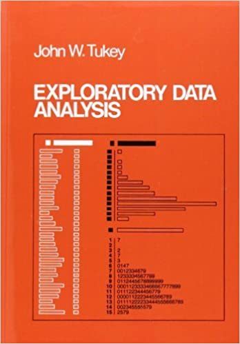
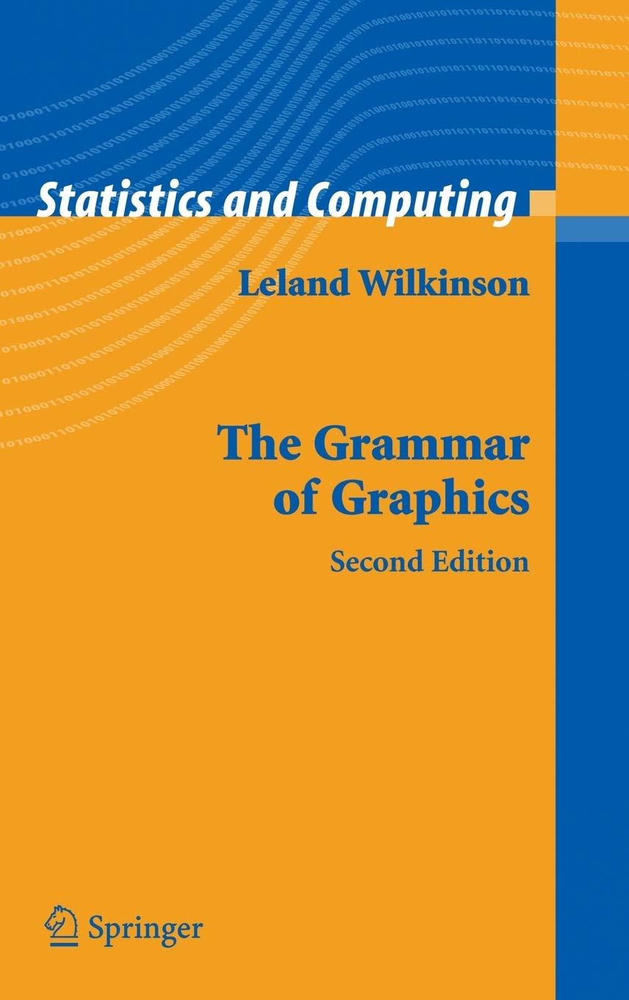
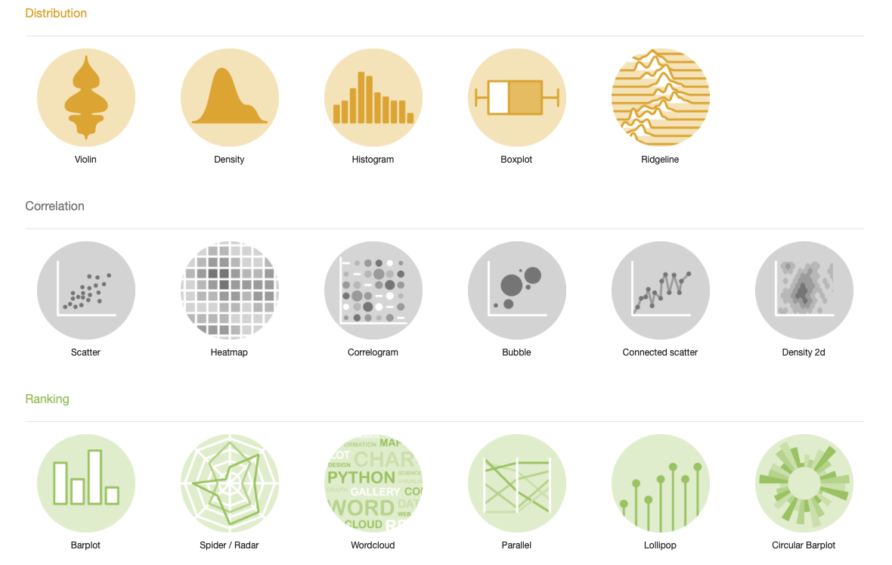

```{r initial, echo = FALSE, cache = FALSE, results = 'hide'}
library(knitr)
options(htmltools.dir.version = FALSE, htmltools.preserve.raw = FALSE,
  tibble.width = 60, tibble.print_min = 6)
opts_chunk$set(
  echo = TRUE, warning = FALSE, message = FALSE, comment = "#>",
  fig.path = 'figure/', cache.path = 'cache/', cache = TRUE, fig.retina = 3,
  fig.align = 'center', fig.width = 12, fig.height = 8.5, fig.show = 'hold',
  dpi = 120
)
```

```{r xaringan-panelset, echo = FALSE}
xaringanExtra::use_panelset()
```

```{r external, include = FALSE, cache = FALSE}
read_chunk('R/03-data-vis.R')
```

.pull-left[
<br>
> The greatest value of a picture is when it forces us to notice what we never expected to see.
> <br> -- [John W. Tukey](https://en.wikipedia.org/wiki/John_Tukey)
]
.pull-right[
<br>
.center[]
]

???

* John Tukey, one of the most well-known stat
* invent boxplot, stem-and-leaf (pencil and paper)
* coined the term EDA

---

## numbers vs plots

.pull-left[
```{r numbers, echo = 4}
```
]

--

.pull-right[
```{r plots, fig.width = 4, fig.height = 4, echo = FALSE}
```
]

???

* humans digest info quicker through eyes than reading tables. -> ytb, tt
* numbers on their own don't make sense to us.

---

## numbers vs plots


.footnote[image credit: Steph Locke]

???

* simple stats cannot reveal full pic.
* all xy data tbl share the same mean/sd/corr, but different str in data...

---

## Why data visualisation?`r emo::ji('bar_chart')`

> A picture is worth a thousand words. -- Henrik Ibsen  

1. Data visualisation communicates information much quicker than numerical tables.
2. Data visualisation can reveal unexpected structures in data; it is not surprising that data visualisation is one of the key tools in exploratory data analysis.
3. Data plot is usually more eye-catching even if you lose accuracy of the information.

---

class: middle inverse

## Charts `r emo::ji("boxing_glove")` Graphics

???

* When we talk about data vis, we use plots, charts, graphics interchangablely
* But when comes to stats, there's difference bt.
* What do we mean by graphics, how to make graphics

---

## A toy example

<br>
.pull-left[
```{r toy-df, echo = 5}
```
]
.pull-right[
* `dept`: discrete/categorical
* `count`: quantitative/numeric
<hr>
What types of plots can we make?
1. bar plot for counts
2. pie chart for proportions
]

???


---

## Named charts

.pull-left[
* Bar plot
```{r base-barplot, fig.width = 4, fig.height = 4}
```
]
.pull-right[
* Pie chart
```{r base-pieplot, fig.width = 4, fig.height = 4}
```
]

???

* default r functions
* one-off functions
* What's the fundamental difference bt bar and pie

---

## Seems convenient, but ...

<br>
.pull-left[
.x[
* a limited set of named charts
* single purpose functions
* inconsistent inputs
]
]
.pull-right[
```{r ref.label = "base-barplot", eval = FALSE}
```
```{r ref.label = "base-pieplot", eval = FALSE}
```
]

???

---

.pull-left[
<br>
<br>
.center[]
]
.pull-right[
> Grammar makes language expressive. A language consisting of words and no grammar (statement = word) expresses only as many ideas as there are words. By specifying how words are combined in statements, a grammar expands a language’s scope.
]

???

* a book blew my mind, changed the view to look at stat graphics.
* we can easily run out of names
* we can generate many types of new graphics by combine components following the grammar.
* this books lays the theoretical foundation to {ggplot2}, {tab}, {vega-lite}

---

class: inverse

background-image: url(img/named-gg.png)
background-size: cover

.footnote[image credit: Thomas Lin Pederson]

???

decomposed to

---

class: inverse middle

### The *grammar of graphics* takes us beyond a limited set of .blue[charts (words)] to an almost unlimited world of .blue[graphical forms (statements)]. 
<hr>
### *{ggplot2}* provides a cohesive system for declaratively creating elegant graphics, based on The Grammar of Graphics.

???

* extends gg, and layered gg.
* provides a cohesive and declarative grammar to create graphics

---

.pull-left[
```{r gg-col, fig.width = 4, fig.height = 3.5}
```
]
.pull-right[
```{r gg-pie, fig.width = 4, fig.height = 4}
```
]

???

* Back to our question, the difference
* The difference is plotting bars on the polar coord

---

## A graphing template

```r
ggplot(data = <DATA>, mapping = aes(<MAPPINGS>)) +
  layer(geom = <GEOM>, stat = <STAT>, position = <POSITION>) +
  layer(geom = <GEOM>, stat = <STAT>, position = <POSITION>)
```

1. `data`: tibble/data.frame.
2. `mapping`: .brown[aes]thetic mappings between data variables and visual elements, via `aes()`.
3. `layer()`: a graphical layer is a combination of data, stat and geom with a potential position adjustment.
  * `geom`: geometric elements to render each data observation.
  * `stat`: statistical transformations applied to the data prior to plotting.
  * `position`: position adjustment, such as "identity", "stack", "dodge" etc.

???

* geom: points, bars, lines, text
* stat: "identity", leave as is, boxplot, five numbers
* `+`: layer + layer
* When you think about a graphic to make:
  + which geom to represent the data
  + any stats to be used

---

## Layers: a bar chart `r emo::ji('bar_chart')`

```{r gg-layer, fig.height = 3.8, fig.width = 4}
```

---

## Aesthetic mapping: positional

```{r aes-map, fig.height = 3.8, fig.width = 4}
```

???

* `ggplot()` initialise the plot
* save a ggplot obj to a symbol

---

## Geoms .small[(a shorthand to `layer()`)]

.pull-left[
```{r gg-bar, fig.height = 3.8, fig.width = 4}
```
]
.pull-right[
```{r gg-col2, eval = FALSE}
```
* `stat = "identity"` leaves data as is.
* `geom_col()` is a shortcut to `geom_bar(stat = "identity")`.

**Generally, we use `geom_*()` instead of `layer()` in practice.**
]

???

* auto complete for `geom_*()`

---

## Geoms

.pull-left[
.small[
```{r gg-point, fig.height = 3.8, fig.width = 4}
```
]
]
.pull-right[
.small[
```{r gg-seg, fig.height = 3.8, fig.width = 4}
```
]
]

???

* We don't have to stick with bar
* we can use points/vertical lines
* `geom_segment()`: more aes

---

## Composite geoms: lollipop `r emo::ji("lollipop")` = points + segments

```{r gg-pop, fig.height = 3.5, fig.width = 4}
```

---

## Geom [catalogue](https://ggplot2.tidyverse.org/reference/index.html#section-layers)

```{r geom, echo = FALSE}
geoms <- help.search("^geom_", package = "ggplot2")
geoms$matches %>% 
  select(Entry, Title) %>% 
  group_by(Title) %>% 
  mutate(col = paste0("C", 1:n())) %>% 
  ungroup() %>% 
  pivot_wider(names_from = col, values_from = Entry) %>% 
  mutate(geom = paste(C1, C2, C3, C4, sep = ", "),
         geom = gsub(", NA", "", geom)) %>% 
  select(geom, Title) %>% 
  DT::datatable(colnames = c("geom", "Description"),
                rownames = FALSE,
                options = list(dom = 'tp', ordering=FALSE, pageLength = 5,
                               width = "80%")) 
```

.footnote[source code: Emi Tanaka]

---

## Stats

.pull-left[
* Aggregated (pre-computed)
```{r ref.label = "toy-df", echo = 5}
```
]
.pull-right[
* Disaggregated
```{r sci-disaggregated, echo = 2}
```
]

---

## Stats

.pull-left[
```{r gg-bar-asis, fig.height = 4, fig.width = 4}
```
]
.pull-right[
```{r gg-bar-c, fig.height = 4, fig.width = 4}
```
]

---

## Aesthetic mapping: visual

.pull-left[
```{r gg-bar-col, fig.height = 4, fig.width = 4}
```
]
.pull-right[
```{r gg-bar-fill, fig.height = 4, fig.width = 4}
```
]

---

## Mapping .brown[variables] / Setting .brown[constants]

.pull-left[
```{r ref.label = "gg-bar-fill", fig.height = 4, fig.width = 4}
```
]
.pull-right[
```{r gg-bar-fill-str, fig.height = 4, fig.width = 4}
```
]

???

* bar -> rect -> 2d
  + stroke + fill
+ auto legend

---

## Visual aesthetics

.pull-left[
* `colour`/`color`, `fill`:
  + named colours, e.g. `"red"`
  + RGB specification, e.g. `"#756bb1"`
* `alpha`: opacity between 0 and 1
* `shape`:
  * an integer between 0 and 25
  * a single string, e.g. `"triangle open"`
* `linetype`: 
  * an integer between 0 and 6
  * a single string, e.g. `"dashed"`
* `size`, `radius`: a numerical value (in millimetres)
]
.pull-right[
<br>
<br>

]

---

## Your turn

Describe a bubble chart in terms of grammar of graphics.

```{r bubble-chart, echo = FALSE, fig.height = 4, fig.width = 5}
```

---

## Coords

.pull-left[
* Coordinate systems
  + `coord_cartesian()` (default)
  + ~~`coord_flip()`~~ (deprecated; now you can simply swap `x` and `y`)
  + `coord_map()`
  + `coord_polar()`
]
.pull-right[
```{r gg-arc, fig.height = 5, fig.width = 5}
```
]

???

live demo:
* `ggplot()`
* `ggplot(data)`
* `ggplot(data, aes())`
* inherit aes
+ layers
* swap x and y

---

## Themes: modify the look

.pull-left[
* [Built-in ggplot themes](https://ggplot2.tidyverse.org/reference/ggtheme.html)
  + `theme_grey()`/`theme_gray()`
  + `theme_bw()`, `theme_linedraw()`
  + `theme_light()`, `theme_dark()`
  + `theme_minimal()`, `theme_classic()`
  + `theme_void()`
]
.pull-right[
```{r gg-theme-bw, fig.height = 3.5, fig.width = 5}
```
]

---

## Themes: modify the look

.pull-left[
* Many R packages provide themes
  + [{ggthemes}](https://github.com/jrnold/ggthemes)
  + [{ggthemr}](https://github.com/Mikata-Project/ggthemr)
  + [{hrbrthemes}](https://cinc.rud.is/web/packages/hrbrthemes/)
  + [{ggtech}](https://github.com/ricardo-bion/ggtech)
]
.pull-right[
```{r ggthemes, fig.height = 3.5, fig.width = 4}
```
]

---

## Modify the look of *texts* with `element_text()`

```{r gg-theme, fig.height = 3.5, fig.width = 6}
```

---

## Modify the look of *texts* with `element_text()`


.footnote[image credit: Emi Tanaka]

---

## Modify the look of

.pull-left[
.center[**lines** with `element_line()`]


.footnote[image credit: Emi Tanaka]
]
.pull-right[
.center[**regions** with `element_rect()`]


]

---

class: middle inverse

## Small multiples .small[(or trellis/faceting plots)]

### `r emo::ji("star2")` the idea of conditioning on the values taken on by one or more of the variables in a data set

---

.left-column[
## Facets
]
.right-column[
`mpg` data available from {ggplot2}
```{r mpg}
```
]

---

.left-column[
## Facets
]
.right-column[
```{r gg-mpg, fig.width = 5, fig.height = 4}
```
]

---

.left-column[
## Facets
### - `facet_grid()`
]
.right-column[
```{r gg-facet-rows, fig.width = 5, fig.height = 4}
```
]

---

.left-column[
## Facets
### - `facet_grid()`
]
.right-column[
```{r gg-facet-cols, fig.width = 6, fig.height = 4}
```
]

---

.left-column[
## Facets
### - `facet_grid()`
]
.right-column[
```{r gg-facet-grid, fig.width = 7, fig.height = 4}
```
]

---

.left-column[
## Facets
### - `facet_grid()`
### - `facet_wrap()`
]
.right-column[
```{r gg-facet-wrap, fig.width = 6, fig.height = 4}
```
]

---

class: middle center

background-image: url(img/data-vis-log.png)
background-size: contain

# .large[.orange[Exploratory data visualisation]]

.footnote[image credit: Emi Tanaka]

---

.left-column[
## case study
### - import
]
.right-column[
```{r movies}
```
]

---

.left-column[
## case study
### - import
### - skim
]
.right-column[
.small[
```{r skim-movies, render = knitr::normal_print}
```
]
]

---

.left-column[
## case study
### - import
### - skim
### - vis
]
.right-column[
* Data analysis starts with questions.
.center[

]
]

---

.left-column[
## case study
### - import
### - skim
### - vis
]
.right-column[
<i class="far fa-question-circle"></i> Are movies ratings consistent b/t IMDB & Rotten Tomatoes
.small[
```{r movies-gam, fig.height = 3.5, fig.width = 3.5}
```
]
]

---

.left-column[
## case study
### - import
### - skim
### - vis
]
.right-column[
<i class="far fa-question-circle"></i> Are movies ratings consistent b/t IMDB & Rotten Tomatoes
.small[
```{r movies-hex, fig.height = 4, fig.width = 4}
```
]
]

---

.left-column[
## case study
### - import
### - skim
### - vis
]
.right-column[
<i class="far fa-question-circle"></i> The popularity of major genre
.small[
```{r movies-bar, fig.height = 3.5, fig.width = 5}
```
]
]

---

.left-column[
## case study
### - import
### - skim
### - vis
]
.right-column[
<i class="far fa-question-circle"></i> The likeness of major genre
.small[
```{r movies-boxplot, fig.height = 3.5, fig.width = 5}
```
]
]

---

.left-column[
## case study
### - import
### - skim
### - vis
]
.right-column[
<i class="far fa-question-circle"></i> The likeness of major genre
.small[
```{r movies-density, fig.height = 3.5, fig.width = 6}
```
]
]

---

.left-column[
## case study
### - import
### - skim
### - vis
]
.right-column[
<i class="far fa-question-circle"></i> The likeness of major genre
.small[
```{r movies-ridges, fig.height = 3.5, fig.width = 7}
```
]
]

---

## {ggplot2}-ext `r emo::ji("package")`

> {ggplot2} now has an official extension mechanism. This means that others can now easily create their own stats, geoms and positions, and provide them in other packages. This should allow the ggplot2 community to flourish, even as less development work happens in ggplot2 itself. 

`r emo::ji("arrow_right")` <https://exts.ggplot2.tidyverse.org/gallery/>

---

.pull-left[
[](https://gganimate.com)
```r
library(gganimate)
ggplot(mtcars, aes(factor(cyl), mpg)) +
  geom_boxplot() +
  # Here comes the gganimate code
  transition_states(
    gear,
    transition_length = 2,
    state_length = 1
  ) +
  enter_fade() +
  exit_shrink() +
  ease_aes('sine-in-out')
```
]
.pull-right[
<br>
<br>
<br>

]

---

.left-column[
[](https://ggrepel.slowkow.com/index.html)
]
.right-column[
<br>
<br>
<br>

]

---

## The R Graph Gallery

.center[[](https://www.r-graph-gallery.com)]

???

* d3.js

---

.left-column[
## To be continued ...
]
.right-column[
<blockquote class="twitter-tweet"><p lang="en" dir="ltr">NEW: the Thursday 19 March update of our coronavirus mortality trajectories tracker<br><br>• Italy now has more Covid-19 deaths than China’s total<br>• UK remains on a steeper mortality curve than Italy, while Britain remains far from lockdown<br><br>Live version here: <a href="https://t.co/VcSZISFxzF">https://t.co/VcSZISFxzF</a> <a href="https://t.co/QvByzSj6QX">pic.twitter.com/QvByzSj6QX</a></p>&mdash; John Burn-Murdoch (@jburnmurdoch) <a href="https://twitter.com/jburnmurdoch/status/1240723388336877569?ref_src=twsrc%5Etfw">March 19, 2020</a></blockquote> <script async src="https://platform.twitter.com/widgets.js" charset="utf-8"></script>
]

---

## Reading

.pull-left[
.center[[](https://r4ds.had.co.nz)]
]
.pull-right[
* [Data visualisation](https://r4ds.had.co.nz/data-visualisation.html)
* [{ggplot2} cheatsheet](https://github.com/rstudio/cheatsheets/raw/master/data-visualization-2.1.pdf)
]
