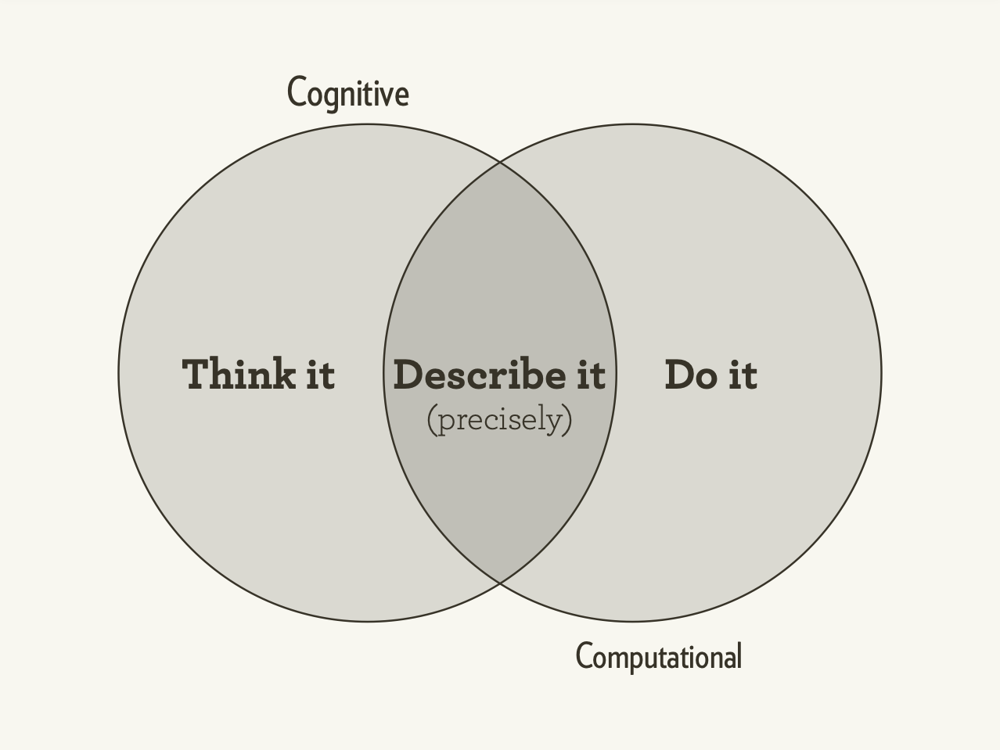
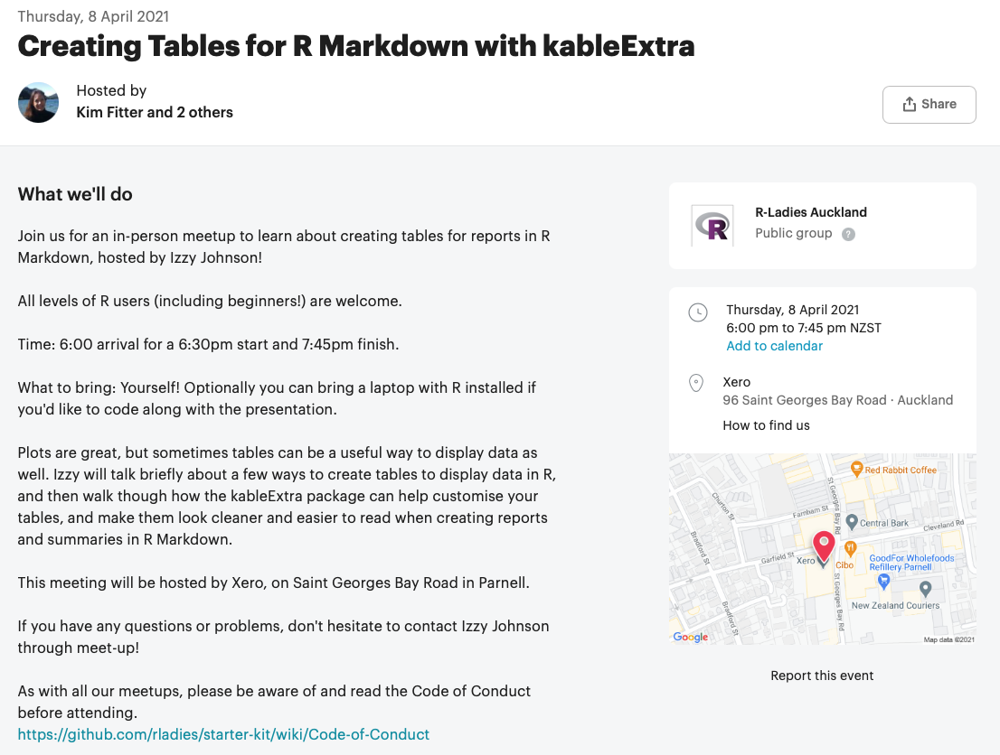

```{r initial, echo = FALSE, cache = FALSE, results = 'hide'}
library(knitr)
options(htmltools.dir.version = FALSE, htmltools.preserve.raw = FALSE, 
  tibble.width = 60, tibble.print_min = 6)
opts_chunk$set(
  echo = TRUE, warning = FALSE, message = FALSE, comment = "#>",
  fig.path = 'figure/', cache.path = 'cache/', cache = FALSE, fig.retina = 3,
  fig.align = 'center', fig.width = 12, fig.height = 8.5, fig.show = 'hold',
  dpi = 120
)
```

```{r xaringan-panelset, echo = FALSE}
xaringanExtra::use_panelset()
```

```{r external, include = FALSE, cache = FALSE}
read_chunk('R/04-data-wrangle.R')
```

## Let's talk about code readability again!

* looooooooooooooooong!

```r
show_up_to_work(have_breakfast(glam_up(dress(shower(wake_up("I"))))))
```

* infinite nesting......

```r
show_up_to_work(
  have_breakfast(
    glam_up(
      dress(
        shower(
          wake_up("I")
        )
      )
    )
  )
)
```

???

* data trans is beyond subsetting
* reshape, summarise by groups
* depends on Qs, the object of interest varies (from individual to aggregated level)
* wrangle ur data to answer ur Qs
* many funs involved 
* eg from we are rladies: morning routine
* from wake up to go to work, interm steps

---

<br>
.pull-left[
## Does this one look better?

```r
morning1 <- wake_up("I")
morning2 <- shower(morning1)
morning3 <- dress(morning2)
morning4 <- glam_up(morning3)
morning5 <- have_breakfast(morning4)
morning6 <- show_up_to_work(morning5)
```

.x[
* many intermediate steps
* not meaningful variable names
]
]

???

* drain off naming ideas

--

.pull-right[
## How about this one?

```r
morning_routine <- "I" %>% 
  wake_up() %>% 
  shower() %>% 
  dress() %>% 
  glam_up() %>% 
  have_breakfast() %>% 
  show_up_to_work()
```
.checked[
* `%>%` for expressing a **linear** sequence of multiple operations
]
]

???

* The code block: from a to z
* ops are important to get your there
* results from these inter ops will not be used.

---

class: inverse middle center


RStudio shortcut: Ctrl/Cmd + Shift + M

???

* r community, obsessed w 2 things
  + pipe
  + hex sticker
* pipe originates from unix

---

## Time use in OECD: `r emo::ji("sleeping_bed")` `r emo::ji("woman_surfing")` `r emo::ji("haircut_woman")` `r emo::ji("woman_teacher")`

```{r read-time-use}
```

???

* how individuals spend their time in OECD countries

---

## Pipe the input into the first argument in the function

```{r gg-time-use, fig.height = 2.5, fig.width = 8, echo = FALSE}
```

.pull-left[
```{r ref.label = "gg-time-use", eval = FALSE}
```
]
.pull-right[
```{r gg-time-use-pipe, eval = FALSE}
```
]

???

* nvm, an awful plot
* seems that there's one country with more time to spend
* special characters: space and (), need backtick

---

class: middle

.left-column[
# .purple[Expressing yourself in <i class='fab fa-r-project'></i>]
]
.right-column[
.center[]
.footnote[Hadley Wickham: Expressing yourself in R [<i class="fab fa-youtube"></i>](https://www.youtube.com/watch?v=1POb5fx_m3I)]
]

???

* as ds, figure out what's your questions/what you want to do
* translate your thoughts into code
* let developers take care of computational side
* the best or worst part of programming to *precisely* instruct computer to do what you want.
* 2017, hadley gave a talk

---

.left-column[
.center[[](http://dplyr.tidyverse.org)]
]
.right-column[
{dplyr} is a grammar of data manipulation, providing a consistent set of **verbs** that help you solve the most common data manipulation challenges:

1. .green[`mutate()`] adds new variables that are functions of existing variables
2. .green[`select()`] picks variables based on their names.
3. .green[`filter()`] picks cases based on their values.
4. .green[`summarise()`] reduces multiple values down to a single summary.
5. .green[`arrange()`] changes the ordering of the rows.

These all combine naturally with .green[`group_by()`] which allows you to perform any operation “by group”.
]

???

* rowwise: filter obs and arrange obs
* colwise
* group-wise
* succinct and expressive

---

class: inverse middle

# One table verbs `r emo::ji("hammer")`

---

## Rename columns

```{r rename}
```

???

* although auto-comp is neat
* deal w colnames many times: lower case, no space

---

## Distinct rows

.pull-left[
```{r distinct}
```
]
.pull-right[
```{r distinct2}
```
]

???

* massive data
* check dups

---

.left-column[
## Verbs
### - rowwise
]
.right-column[
* `slice()`: subsets rows using their positions
```{r slice}
```
.brown[`n()` is a context dependent function: the current group size]
]

---

.left-column[
## Verbs
### - group by
]
.right-column[
* `group_by()`: group by one or more variables
```{r group-by, highlight.output = 2}
```
]

---

.left-column[
## Verbs
### - groupwise
]
.right-column[
* `group_by()`: use in conjunction with other verbs
```{r slice-gb, highlight.output = 2}
```
]

---

.left-column[
## Verbs
### - groupwise
]
.right-column[
* `slice()` shortcuts: `slice_head()` & `slice_tail()`
```{r slice-head, highlight.output = 2}
```
]

---

.left-column[
## Verbs
### - group by
### - ungroup
]
.right-column[
* `ungroup()`: removes grouping
```{r ungroup}
```
]

---

.left-column[
## Verbs
### - rowwise
]
.right-column[
* `r emo::ji("seedling")``slice_sample()` randomly selects rows
```{r slice-sample}
```
]

???

* random sampling
* bootstrapping

---

.left-column[
## Verbs
### - rowwise
]
.right-column[
* `arrange()`: arrange rows by columns
```{r arrange}
```
.brown[`arrange()` in ascending order by default]
]

---

.left-column[
## Verbs
### - rowwise
]
.right-column[
* `arrange()`: arrange rows by columns
```{r arrange-desc}
```
.brown[use `desc()` in descending order]
]

---

.left-column[
## Verbs
### - rowwise
]
.right-column[
* `arrange()`: arrange rows by columns
```{r arrange-desc2}
```
]

---

.left-column[
## Verbs
### - rowwise
]
.right-column[
* `filter()`: subsets rows using columns
```{r filter}
```
.brown[`filter()` observations that satisfy your conditions]
]

---

.left-column[
## Verbs
### - rowwise
]
.right-column[
* `filter()`: subsets rows using columns
```{r filter-gb}
```
]

---

.left-column[
## Verbs
### - rowwise
]
.right-column[
* `filter()`: subsets rows using columns
```{r filter-in}
```
]

---

.left-column[
## Verbs
### - rowwise
]
.right-column[
* `filter()`: subsets rows using columns
```{r filter-not}
```
]

---

.left-column[
## Verbs
### - rowwise
]
.right-column[
* `filter()`: subsets rows using columns
```{r filter-and, results = "hold", eval = 1}
```
]

---

.left-column[
## Verbs
### - rowwise
]
.right-column[
* `filter()`: subsets rows using columns
.center[]
]

---

.left-column[
## Verbs
### - rowwise
]
.right-column[
* `filter()`: subsets rows using columns
```{r filter-or}
```
.brown[`|`: either ... or ...]
]

---

## Logical operators

.center[
```{r logical-op}
```
]

.pull-left[
* element-wise comparisons:

```{r logical-op-el}
```
]
.pull-right[
* first-element only comparisons:

```{r logical-op-first}
```
]

---

.left-column[
## Verbs
### - rowwise
]
.right-column[
* `filter()`: subsets rows using columns
```{r filter-anz}
```
```{r filter-anz-line, echo = FALSE, fig.width = 3, fig.height = 3.5}
```
]

???

* from now, started in looking at the anz data

---

.left-column[
## Verbs
### - rowwise
### - colwise
]
.right-column[
* `select()`: subsets columns using their names and types
```{r select, eval = 1, results = "hold"}
```
]

---

.left-column[
## Verbs
### - rowwise
### - colwise
]
.right-column[
Selection helpers
  + `starts_with()`: starts with a prefix.
  + `ends_with()`: ends with a suffix.
  + `contains()`: contains a literal string.
  + [more helpers](https://dplyr.tidyverse.org/reference/select.html#overview-of-selection-features)
```{r select-helpers}
```
]

---

.left-column[
## Verbs
### - rowwise
### - colwise
]
.right-column[
* `mutate()`: creates, modifies, and deletes columns
```{r mutate}
```
]

---

.left-column[
## Verbs
### - rowwise
### - colwise
]
.right-column[
* `mutate()`: creates, modifies, and deletes columns
.center[]
]

---

## `case_when()`: when it's the case, do something

.pull-left[
<br>
<br>
.center[]
]
.pull-right[
```{r opts, echo = FALSE}
op <- options(width = 40)
```
<br>
```{r case-when}
```
```{r opts-exit, echo = FALSE}
on.exit(options(op), add = TRUE)
```
]

---

.left-column[
## Verbs
### - rowwise
### - colwise
]
.right-column[
* `summarise()`: summarises to one row
```{r summarise}
```
]

---

.left-column[
## Verbs
### - rowwise
### - colwise
]
.right-column[
* `summarise()`: summarises each group to fewer rows
```{r summarise-gb}
```
]

---

## Chain with `%>%`

.pull-left[
```{r ref.label = "filter-anz", eval = FALSE}
```
```{r ref.label = "mutate", eval = FALSE, echo = 1:7}
```
```{r ref.label = "summarise-gb", eval = FALSE}
```
]
.pull-right[
```{r chain, eval = FALSE}
```
]

---

class: middle

## When to `%>%`

.pull-left[
```{r ref.label = "chain", eval = FALSE}
```
]
.pull-right[
1. Linear code dependency structure
2. < 10 steps
3. Inputs and outputs of the same type
   + {dplyr} verbs, tibble in and out
]

???

* The {tidyverse} is designed for data-centric tasks
* a tibble in and a tibble out, that's why you can chain with ` %>% `

---

## Handy shortcuts

```{r shortcuts, results = "hold", eval = 1}
```

---

## Hello again, SQL!

```{r dbplyr-con, cache = FALSE, highlight.output = 1:3}
```

---

## Write {dplyr} code as usual to manipulate database <i class="fas fa-database"></i>

```{r dbplyr-verbs, cache = FALSE}
```

---

## Speak in SQL from R

.pull-left[
.center[Show SQL queries]
.small[
```{r dbplyr-q, cache = FALSE}
```
]
]
.pull-right[
.center[Retrieve results to R]
.small[
```{r dbplyr-collect, cache = FALSE}
```
]
]


???

* SQL is a beautiful and expressive language
* dplyr is heavily inspired by SQL, but easier to use
* as ds, you describe the data you want, and de write SQL to extract the data

---

class: inverse middle

## Relational data
<hr>
### Multiple tables of data are called *relational data* because of the relations.

---

## Keys `r emo::ji("key")`

.center[A key is a variable (or set of variables) that uniquely identifies an observation.]

* A **primary key** uniquely identifies an observation in its own table.
* A **foreign key** uniquely identifies an observation in another table.

.pull-left[
.small[
```{r ref.label = "rename", echo = 2}
```
]
]
.pull-right[
.small[
```{r countrycode}
```
]
]

---

class: middle

## Your turn

> What's the key for the `time_use` data?

`r countdown::countdown(minutes = 0, seconds = 30, font_size = "48px", top = 0)`

---

class: inverse middle

## Two table verbs`r emo::ji("handshake")`

---

## A second data table

* Join `country` from `country_code` to `time_use`, by common values
* Common values: `country` from `time_use`, but `country_name` from `country_code`

.pull-left[
.small[
```{r time-use-2}
```
]
]
.pull-right[
.small[
```{r countrycode2}
```
]
]

???

* show 3 ways of printing

---

.left-column[
## Joins
### - mutating joins
]
.right-column[
**Mutating joins:** .brown[add new variables] to one data frame from matching observations in another.
<br>
<br>
<br>
.center[]
]

---

.left-column[
## Joins
### - mutating joins
]
.right-column[
* `inner_join()`: All rows from `x` where there are matching values in `y`, and all columns from `x` and `y`

.center[]

.footnote[image credit: Garrick Aden-Buie]
]

---

.left-column[
## Joins
### - mutating joins
]
.right-column[
* `inner_join()`: All rows from `x` where there are matching values in `y`, and all columns from `x` and `y`

```{r inner-join}
```
]

???

* live: leave `by` default
* existing `country` column, dup name will be `.y` suffix

---

.left-column[
## Joins
### - mutating joins
]
.right-column[
* `left_join()`: All rows from `x`, and all columns from `x` and `y`. Rows in `x` with no match in `y` will have `NA` values in the new columns.

.center[]

.footnote[image credit: Garrick Aden-Buie]
]

---

.left-column[
## Joins
### - mutating joins
]
.right-column[
* `left_join()`: All rows from `x`, and all columns from `x` and `y`. Rows in `x` with no match in `y` will have `NA` values in the new columns.
```{r left-join}
```
]

---

.left-column[
## Joins
### - mutating joins
]
.right-column[
* `left_join()`: All rows from `x`, and all columns from `x` and `y`. .brown[Rows in `x` with no match in `y` will have `NA` values in the new columns.]
```{r left-join-na}
```
]

---

.left-column[
## Joins
### - mutating joins
]
.right-column[
* `right_join()`: All rows from `y`, and all columns from `x` and `y`. Rows in `y` with no match in `x` will have `NA` values in the new columns.
.center[]

.footnote[image credit: Garrick Aden-Buie]
]

---

.left-column[
## Joins
### - mutating joins
]
.right-column[
* `right_join()`: All rows from `y`, and all columns from `x` and `y`. Rows in `y` with no match in `x` will have `NA` values in the new columns.
```{r right-join}
```
]

---

.left-column[
## Joins
### - mutating joins
]
.right-column[
* `full_join()`: All rows and all columns from both `x` and `y`. Where there are not matching values, returns `NA` for the one missing.
.center[]

.footnote[image credit: Garrick Aden-Buie]
]

---

.left-column[
## Joins
### - mutating joins
]
.right-column[
* `full_join()`: All rows and all columns from both `x` and `y`. Where there are not matching values, returns `NA` for the one missing.
```{r full-join}
```
]

---

.left-column[
## Joins
### - mutating joins
### - filtering joins
]
.right-column[
**Filtering joins:** .brown[filter observations] from one data frame based on whether or not they match an observation in the other table.
* `semi_join()`: All rows from `x` where there are matching values in `y`, keeping just columns from `x`.
.center[]

.footnote[image credit: Garrick Aden-Buie]
]

---

.left-column[
## Joins
### - mutating joins
### - filtering joins
]
.right-column[
* `semi_join()`: All rows from `x` where there are matching values in `y`, keeping just columns from `x`.
```{r semi-join}
```
]

---

.left-column[
## Joins
### - mutating joins
### - filtering joins
]
.right-column[
* `anti_join()`: All rows from `x` where there are **not** matching values in `y`, keeping just columns from `x`.
.center[]

.footnote[image credit: Garrick Aden-Buie]
]

---

.left-column[
## Joins
### - mutating joins
### - filtering joins
]
.right-column[
* `anti_join()`: All rows from `x` where there are **not** matching values in `y`, keeping just columns from `x`.
```{r anti-join}
```
]

---

class: middle

## Useful functions

.pull-left[
* one table verbs
  * `pull()`
  * `transmute()`
  * `relocate()`
* two table verbs
  * `bind_rows()`
  * `bind_cols()`
]
.pull-right[
* set operations
  + `union()`
  + `union_all()`
  + `setdiff()`
  + `intersect()`
]

---

class: center

## .purple[Upcoming R-Ladies meetup]

[](https://www.meetup.com/en-AU/rladies-auckland/events/276942471)

---

## Reading

.pull-left[
.center[[](https://r4ds.had.co.nz)]
]
.pull-right[
* [Pipes](https://r4ds.had.co.nz/pipes.html)
* [Data transformation](https://r4ds.had.co.nz/transform.html)
* [Relational data](https://r4ds.had.co.nz/relational-data.html)
* [{dplyr} cheatsheet](https://github.com/rstudio/cheatsheets/raw/master/data-transformation.pdf)
]
