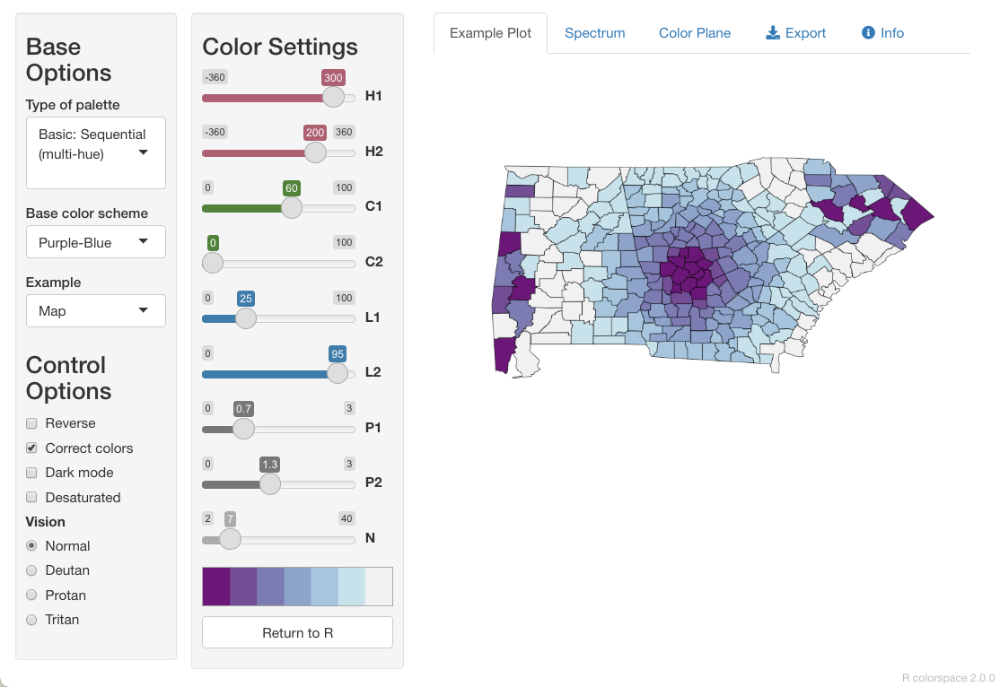
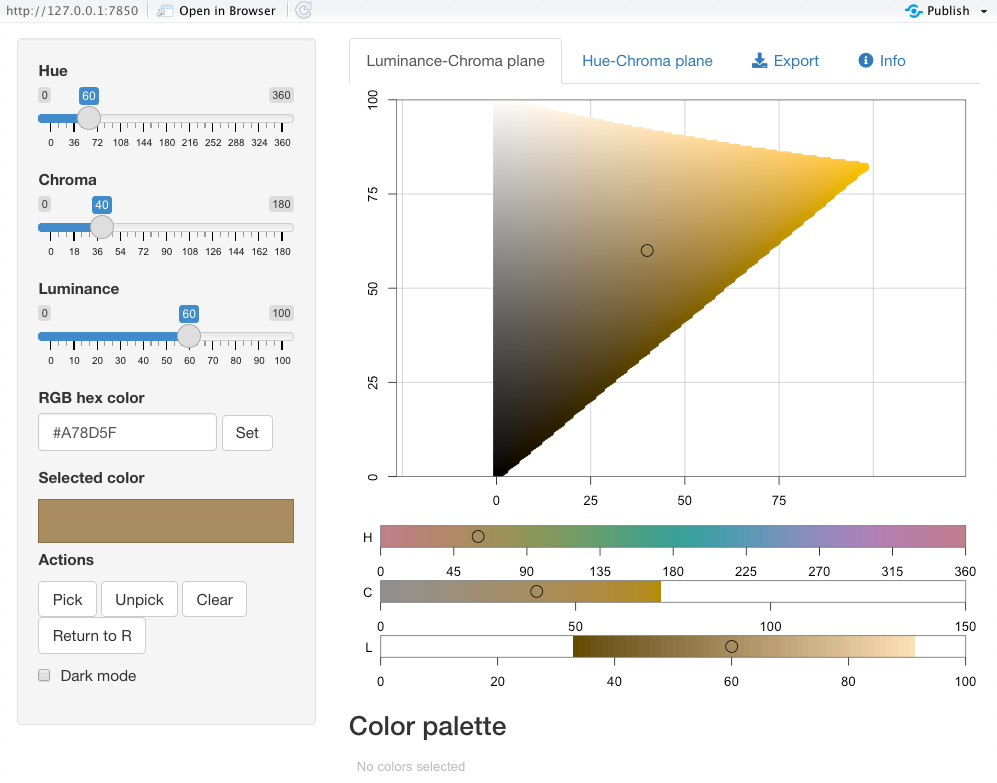

class: inverse middle

```{r initial, echo = FALSE, cache = FALSE, results = 'hide'}
library(knitr)
options(htmltools.dir.version = FALSE, htmltools.preserve.raw = FALSE, 
  tibble.width = 60, tibble.print_min = 6)
opts_chunk$set(
  echo = TRUE, warning = FALSE, message = FALSE, comment = "#>",
  fig.path = 'figure/', cache.path = 'cache/', cache = TRUE, fig.retina = 3,
  fig.align = 'center', fig.width = 4.5, fig.height = 4, fig.show = 'hold',
  dpi = 120
)
```

```{r xaringan-panelset, echo = FALSE}
xaringanExtra::use_panelset()
```

```{r external, include = FALSE, cache = FALSE}
read_chunk('R/07-data-vis2.R')
```

## Graphical perception `r emo::ji("eyes")`

--

### .blue[1.] Preattentive processing
### .blue[2.] Proximity
### .blue[3.] Position vs angle
### .blue[4.] Colour matters

???

* how human perceive a plot
* given the same amount of info from plots, which data type help us to perceive more accurate info

---

## Preattentive processing

.pull-left[
```{r t-shape, echo = FALSE, fig.width = 2.3, fig.height = 2.3}
```
]

--

.pull-right[
```{r shape, echo = FALSE, fig.width = 2.3, fig.height = 2.3}
```
]

--

.center[
```{r colour, echo = FALSE, fig.width = 2.3, fig.height = 2.3}
```
]

???

* Have you noticed there are unusual data points? Can you locate them?
* how about this one?

---

## Preattentive processing .small[.green[colour > form (shape)]]

.pull-left[
```{r t-shape2, ref.label = "t-shape", echo = FALSE, fig.width = 2.3, fig.height = 2.3}
```
]

.pull-right[
```{r shape2, ref.label = "shape", echo = FALSE, fig.width = 2.3, fig.height = 2.3}
```
]

.center[
```{r colour2, ref.label = "colour", echo = FALSE, fig.width = 2.3, fig.height = 2.3}
```
]

???

* Which plot helps you to distinguish the data points?
* Which plot consumes your least attention?
* viewers can sense certain features, b/f our mind starts to pay attention to any specific objs. 

---

## Proximity .small[.green[Make easy comparisons by grouping elements together]]

```{r time-use, echo = FALSE}
```

.pull-left[
* compare time use by categories within each country
```{r fill-cat, fig.width = 4, fig.height = 4, echo = FALSE}
```
]
.pull-right[
* compare time use by countries within each category
```{r fill-country, fig.width = 4, fig.height = 4, echo = FALSE}
```
]

???

* left: it's not easy to compare how much time spent on sleep across countries

---

## Position vs angle .small[.green[position > angle]]

.pull-left[
```{r "fill-country2", ref.label = "fill-country", fig.width = 4, fig.height = 4, echo = FALSE}
```
]
.pull-right[
```{r angle, fig.width = 4, fig.height = 4, echo = FALSE}
```
.center[Pie charts are BAD`r emo::ji("bangbang")`]
]

???

* "Other" and "Sleep", can u easily perceive these subtle differences from the pie charts?
* But
* A bar chart or dot chart is a preferable way of displaying this type of data.

---

## Absolute vs relative positions .small[.green[absolute > relative]]

.pull-left[
```{r fill-country3, ref.label = "fill-country", fig.width = 4, fig.height = 4, echo = FALSE}
```
]
.pull-right[
```{r rel-pos, fig.width = 4, fig.height = 4, echo = FALSE}
```
]

???

* absolute -> share the same base line. we compare their heights
* right: 100% bar chart. its much harder to compare NZ to others, bc NZ is rel.
* The eye is good at judging abs and bad at judging relative.

---

class: inverse middle

## Colour matters

--

### .blue[1.] Colour spaces
### .blue[2.] Colour scales
### .blue[3.] Colour blindness

---

class: middle

## 3 ways to represent colour spaces

1. RGB
2. HSV/HSL
3. HCL .small[.green[for humans]]

---

## RGB

* Red *(0-255)*: amount of .red[red] light
* Green *(0-255)*: amount of .green[green] light
* Blue *(0-255)*: amount of .blue[blue] light

.center[]

.footnote[image credit: Claus O. Wilke]

???

* for computer & screen

---

## HSV

* Hue *(0-360)*: hue of the colour
* Saturation *(0-1)*: colourfulness relative to the brightness of the colour
* Value *(0-1)*: subjective perception of amount of light emitted

.center[]

.footnote[image credit: Claus O. Wilke]

---

## HSL

* Hue *(0-360)*: hue of the colour
* Lightness *(0-1)*: brightness relative to the brightness of a illuminated white
* Saturation *(0-1)*: colourfulness relative to the brightness of the colour

.center[]

.footnote[image credit: Claus O. Wilke]

---

## HCL .small[.green[aka polar LUV]]

* Hue *(0-360)*: hue of the colour
* Chroma *(0-180)*: degree of vividness of a colour
* Luminance *(0-100)*: amount of light emitted

.center[]

.footnote[image credit: Claus O. Wilke]

???

HCL: perceptually-based and device-independent

---

## Encoding too much

```{r time-use-bad, echo = FALSE, fig.height = 5, fig.width = 8}
```

???

* default ggplot2 colour scales -> not colour blind friendly
* more than 7 qualitative colours, matching colours to categories are cumbersome
* colour can be effective tool to enhance
* choose colour wisely

---

class: middle

## Colour scales

.large[.green[**3**]] fundamental use cases for colours in data visualisations:

1. use colour to distinguish groups of data from each other
2. use colour to represent data values
3. use colour to highlight

<hr>

.large[.green[**3**]] types of colour palettes .small[[ColorBrewer](https://colorbrewer2.org/#type=sequential&scheme=BuGn&n=3)]

1. Qualitative
2. Sequential
3. Diverging

---

## Qualitative palettes .small[.green[for categorical data with no intrinsic ordering]]

```{r colorspace-q, fig.height = 4}
```

???

* use colour to distinguish discrete items/groups, but doesn't give impression of an order
* a finite set of specific colours that are chosen to look clearly distinct
* no one single colour stands out relative to the others

---

## Sequential palettes .small[.green[for ordered data from high to low]]

```{r colorspace-s, fig.height = 4, fig.width = 8.5}
```

???

* heatmap: used colour to represent data values, like temperature
* representing continuous/ordered values
* colours indicate which data values are larger or smaller
* the diff bt colours shows the diff b/t data values
* seq colour needs to be perceived to vary uniformly across its entire range by changing hues

---

## Diverging palettes .small[.green[for mid-range values and extremes at both ends]]

```{r colorspace-d, fig.height = 4, fig.width = 5}
```

???

* vis the deviation of data values in one of 2 directions rel to a neutral midpoint
* a straightforward eg is vis +/- values
* think of a diverging scale as joining 2 seq sales at a common midpoint

---

## Use colour palettes

.pull-left[
<br>
```{r gg-palette, eval = FALSE}
```
]
.pull-right[
```{r gg-palette2, ref.label = "gg-palette", echo = FALSE}
```
]

---

## Set custom colours

.pull-left[
<br>
```{r gg-manual, eval = FALSE}
```
]
.pull-right[
```{r gg-manual2, ref.label = "gg-manual", echo = FALSE}
```
]

---

## Colour-vision deficiency

.pull-left[
.center[</img>]
* Red-green colour-vision deficiency (deuteranomaly & protanomaly) is the most common.
]
.pull-right[
.center[</img>]
* Blue-green colour-vision deficiency (tritanomaly) is rare but does occur.
]

<br>

`r emo::ji("information")` *Approximately 8% of males and 0.5% of females suffer from some sort of color-vision deficiency.*

.footnote[reference: Claus O. Wilke [Fundamentals of Data Visualization](https://clauswilke.com/dataviz/)]

???

* A small prop of people with impaired colour vision have difficulty to distinguish certain types of colours

---

## Choose colours using {colorspace}

.pull-left[
* `colorspace::hclwizard()`

.center[</img>]
]
.pull-right[
* `colorspace::hcl_color_picker()`

.center[</img>]
]

---

class: middle

## Scales

* Control how data is mapped to perceptual properties, and produce guides (axes and legends) which allow us to read the plot.
* Important arguments: `breaks`, `labels`, and `limits`.
* Naming scheme: `scale_[aes]_[datatype]()`

---

```{r scales, echo = FALSE}
scales <- help.search("^scale_", package = "ggplot2")
scales$matches %>% 
  select(Entry, Title) %>% 
  group_by(Title) %>% 
  mutate(col = paste0("C", 1:n())) %>% 
  ungroup() %>% 
  pivot_wider(names_from = col, values_from = Entry) %>% 
  mutate(scale = paste(C1, C2, C3, C4, sep = ", "),
         scale = gsub(", NA", "", scale)) %>% 
  select(scale, Title) %>% 
  DT::datatable(colnames = c("scale", "Description"),
                rownames = FALSE,
                options = list(dom = 'tp', ordering=FALSE, pageLength = 5,
                               width = "80%")) 
```

???

---

class: inverse middle

## Publication-ready visualisation `r emo::ji("woman_artist")`

---

.left-column[
## Towards publication-ready visualisation
]
.right-column[
<blockquote class="twitter-tweet"><p lang="en" dir="ltr"><a href="https://twitter.com/hashtag/MakingOf?src=hash&amp;ref_src=twsrc%5Etfw">#MakingOf</a> of last week&#39;s <a href="https://twitter.com/hashtag/TidyTuesday?src=hash&amp;ref_src=twsrc%5Etfw">#TidyTuesday</a> plot <a href="https://t.co/Jsg41id5Nw">https://t.co/Jsg41id5Nw</a> <a href="https://t.co/dP6tSrjHy0">pic.twitter.com/dP6tSrjHy0</a></p>&mdash; Georgios Karamanis (@geokaramanis) <a href="https://twitter.com/geokaramanis/status/1374066377879908358?ref_src=twsrc%5Etfw">March 22, 2021</a></blockquote> <script async src="https://platform.twitter.com/widgets.js" charset="utf-8"></script>
]

---

class: middle

.pull-left[
## .center[Exploratory data visualisation]

* For **internal use** only. Need to be able to create rapidly because your first attempt will never be the most revealing.
* Iteration is crucial for developing multiple displays of your data.
]
.pull-right[
## .center[Communication graphics]

* When you **communicate** your findings, you need to spend much time polishing your graphics to eliminate distractions and focus on the storytelling.
* Iteration is crucial to ensure all the bits and pieces works well: labels, color choices, tick marks...
]

---

class: middle

## Case study: COVID-19

```{r covid}
```

---

.left-column[
## COVID-19
### - scale-y
]
.right-column[
## Data as is

.panelset[

.panel[.panel-name[Plot]

```{r covid-scale0, echo = FALSE, fig.width = 7, fig.height = 3.5}
```

.panel[.panel-name[Code]

```{r ref.label = "covid-scale0", eval = FALSE}
```
]
]
]
]

???

full screen of legends

---

.left-column[
## COVID-19
### - scale-y
]
.right-column[
## Logarithmic scale

.panelset[

.panel[.panel-name[Plot]

```{r covid-scale1, echo = FALSE, fig.width = 7, fig.height = 3.5}
```

.panel[.panel-name[Code]

```{r ref.label = "covid-scale1", eval = FALSE}
```
]
]
]
]

???

perceive the rate of infections, slowing down

---

.left-column[
## COVID-19
### - scale-y
]
.right-column[
## Logarithmic scale

.panelset[

.panel[.panel-name[Plot]

```{r covid-scale-log10, echo = FALSE, fig.width = 7, fig.height = 3.5}
```

.panel[.panel-name[Code]

```{r ref.label = "covid-scale-log10", eval = FALSE}
```
]
]
]

.footnote[Rob J Hyndman's blog post on [Why log ratios are useful for tracking COVID-19](https://robjhyndman.com/hyndsight/logratios-covid19/)]
]

---

.left-column[
## COVID-19
### - scale-y
### - scale-x
]
.right-column[
```{r covid-rel}
```
]

???

log(0) -> Inf

---

.left-column[
## COVID-19
### - scale-y
### - scale-x
]
.right-column[
## Relative days

.panelset[

.panel[.panel-name[Plot]

```{r covid-rel-p, echo = FALSE, fig.width = 7, fig.height = 3.5}
```

.panel[.panel-name[Code]

```{r ref.label = "covid-rel-p", eval = FALSE}
```
]
]
]
]

---

.left-column[
## COVID-19
### - scale-y
### - scale-x
### - highlight
]
.right-column[
## Highlight New Zealand

.panelset[

.panel[.panel-name[Plot]

```{r covid-rel-nz, echo = FALSE, fig.width = 7, fig.height = 3.5}
```

.panel[.panel-name[Code]

```{r ref.label = "covid-rel-nz", eval = FALSE}
```
]
]
]
]

---

.left-column[
## COVID-19
### - scale-y
### - scale-x
### - highlight
### - annotate
]
.right-column[
## Label New Zealand

.panelset[

.panel[.panel-name[Plot]

```{r covid-rel-nz-lab, echo = FALSE, fig.width = 7, fig.height = 3.5}
```

.panel[.panel-name[Code]

```{r ref.label = "covid-rel-nz-lab", eval = FALSE}
```
]
]
]
]

---

.left-column[
## COVID-19
### - scale-y
### - scale-x
### - highlight
### - annotate
### - limits
]
.right-column[
## Expand limits

.panelset[

.panel[.panel-name[Plot]

```{r covid-rel-nz-lim, echo = FALSE, fig.width = 7, fig.height = 3.5}
```

.panel[.panel-name[Code]

```{r ref.label = "covid-rel-nz-lim", eval = FALSE}
```
]
]
]
]

---

.left-column[
## COVID-19
### - scale-y
### - scale-x
### - highlight
### - annotate
### - limits
### - labels
]
.right-column[
## Every figure needs the title

.panelset[

.panel[.panel-name[Plot]

```{r covid-rel-nz-title, echo = FALSE, fig.width = 7, fig.height = 3.5}
```

.panel[.panel-name[Code]

```{r ref.label = "covid-rel-nz-title", eval = FALSE}
```
]
]
]
]

---

.left-column[
## COVID-19
### - scale-y
### - scale-x
### - highlight
### - annotate
### - limits
### - labels
### - theme
]
.right-column[
## Apply themes

.panelset[

.panel[.panel-name[Plot]

```{r covid-rel-nz-theme, echo = FALSE, fig.width = 7, fig.height = 3.5}
```

.panel[.panel-name[Code]

```{r ref.label = "covid-rel-nz-theme", eval = FALSE}
```
]
]
]
]

---

class: inverse middle

## Interactive graphics

---

## Easily turn ggplot2 into [plotly](https://plotly-r.com)

```{r plotly, eval = FALSE}
```

.center[<iframe src="figure/plotly.html" width="800" height="500" seamless="seamless" frameBorder="0"> </iframe>]

---

class: inverse middle

## Generative art

---

## .center[A peek at [generative art works by Thomas Lin Pedersen](https://www.data-imaginist.com/art)]


---

## Reading

.pull-left[
.center[[](https://r4ds.had.co.nz)]
]
.pull-right[
* [Graphics for communication](https://r4ds.had.co.nz/graphics-for-communication.html)
* [BBC Visual and Data Journalism cookbook for R graphics](https://bbc.github.io/rcookbook/)
]
