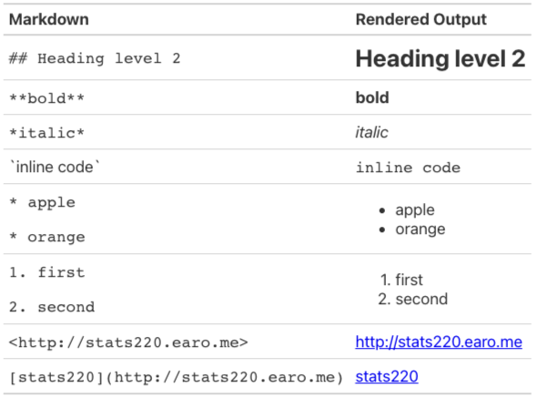
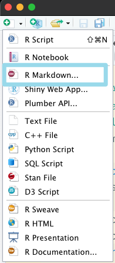
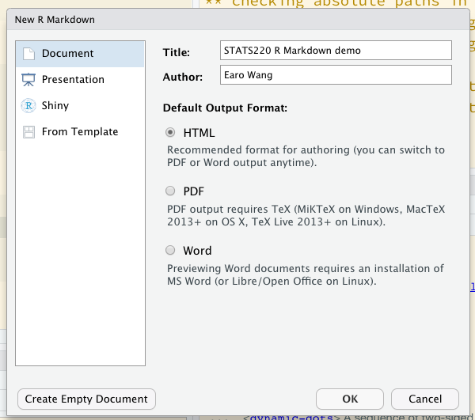
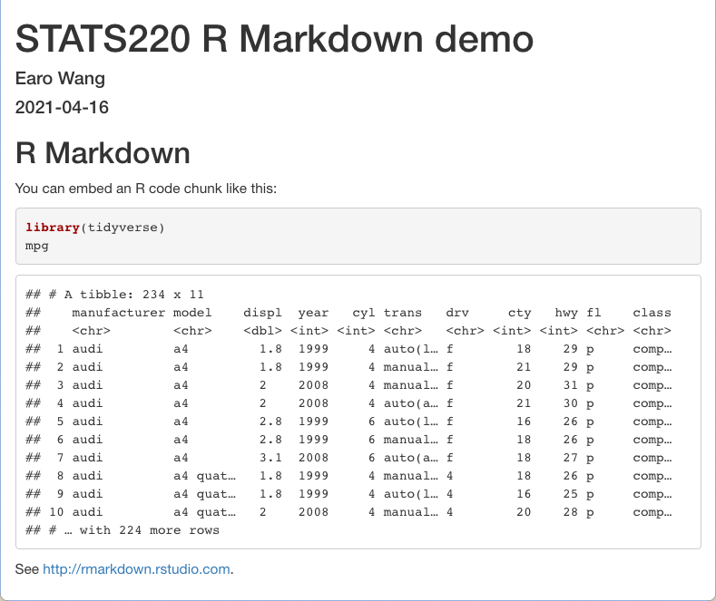

class: middle

```{r initial, echo = FALSE, cache = FALSE, results = 'hide'}
library(knitr)
options(htmltools.dir.version = FALSE, htmltools.preserve.raw = FALSE, 
  tibble.width = 60, tibble.print_min = 6)
opts_chunk$set(
  echo = TRUE, warning = FALSE, message = FALSE, comment = "#>",
  fig.path = 'figure/', cache.path = 'cache/', cache = TRUE, fig.retina = 3,
  fig.align = 'center', fig.width = 4.5, fig.height = 4, fig.show = 'hold',
  dpi = 120
)
```

```{r xaringan-panelset, echo = FALSE}
xaringanExtra::use_panelset()
```

.pull-left[
.center[
[](https://rmarkdown.rstudio.com)
[](https://bookdown.org/yihui/blogdown/)

[](http://bookdown.org)
[](http://slides.yihui.org/xaringan/)
]
]
.pull-right[
## .center[Dynamic documents]

* Combine code, rendered output (such as figures), and prose
* Reproduce your analyses
* Collaborate and share code with others
* Communicate your results with others
]

???

* graphics for communication
* keep learning communication
* Rmd: a tool for integrating prose, code, and results
* one md file for multiple documents

---

class: inverse middle center

# .large[.large[.large[<i class="fab fa-r-project"></i>]]] + .large[.large[.large[.blue[<i class="fab fa-markdown"></i>]]]]

???

Rmd: glue 2 things together

---

## Markdown .blue[<i class="fab fa-markdown"></i>] `.md`

* Created by [John Gruber](https://daringfireball.net/projects/markdown/) & [Aaron Swartz](http://www.aaronsw.com) in 2004
* A lightweight .brown[markup language] to add formatting elements to plain-text documents, contrasting to WYSIWYG
* Portable, platform independent, everywhere (e.g. Piazza, but not Canvas `r emo::ji("angry")`)


???

* md originated back to 2004, but emerged around 2010
* aaron, reddit, a loss
* The course website: write in md, and render in html by hugo
* commonmark: it's one of markdown flavours, richer features. e.g. github
* learned it in 5 mins, unlike R

---

class: center middle

## .blue[<i class="fab fa-markdown"></i>] Basic syntax



More on [Markdown syntax](https://www.markdownguide.org/basic-syntax/)

```{r md-syntax, echo = FALSE, eval = FALSE}
library(gt)
tibble::tribble(
  ~ md, ~ rendered,
  "`## Heading level 2`", "## Heading level 2",
  "`**bold**`", "**bold**",
  "`*italic*`", "*italic*",
  "\\`inline code\\`", "`inline code`",
  "`* apple`\n\n`* orange`",  "* apple\n * orange",
  "`1. first`\n\n`2. second`", "1. first\n 2. second",
  "`<http://stats220.earo.me>`", "<http://stats220.earo.me>",
  "`[stats220](http://stats220.earo.me)`", "[stats220](http://stats220.earo.me)"
) %>% 
  gt() %>% 
  fmt_markdown(everything()) %>% 
  cols_label(
    md = md("**Markdown**"),
    rendered = md("**Rendered Output**")
  )
  as_raw_html()
```

---

class: inverse

background-image: url(https://raw.githubusercontent.com/allisonhorst/stats-illustrations/master/rstats-blanks/rmarkdown_wizards_blank.png)
background-size: 100% 100%

---

.pull-left[
## Create R Markdown `.Rmd`
<br>
.center[

]
]
.pull-right[
````markdown
---
title: "STATS220 R Markdown demo"
author: "Earo Wang"
date: "``r 'r'` lubridate::today()`"
output: html_document
---

```{r setup, include = FALSE}`r ''`
library(knitr)
opts_knit$set(root.dir = here::here())
opts_chunk$set(echo = TRUE)
```

## R Markdown

You can embed an R code chunk like this:

```{r gapminder, message = FALSE}`r ''`
library(tidyverse)
gp <- read_rds("data/gapminder.rds")
gp
```

See <http://rmarkdown.rstudio.com>.
````
]

---

.pull-left[
## YAML header
YAML is commonly used for configuration files, and starts and ends with
`---`

````markdown
``r 'r'` lubridate::today()`
````
`r emo::ji("arrow_up")` inline executable R code
* one markdown file, many formats
  + `pdf_document`
  + `xaringan::moon_reader`

.small[
To compile to PDF, 
```r
install.packages('tinytex')
tinytex::install_tinytex()
```
]
]
.pull-right[
````markdown
*---
*title: "STATS220 R Markdown demo"
*author: "Earo Wang"
*date: "``r 'r'` lubridate::today()`"
*output: html_document
*---

```{r setup, include = FALSE}`r ''`
library(knitr)
opts_knit$set(root.dir = here::here())
opts_chunk$set(echo = TRUE)
```

## R Markdown

You can embed an R code chunk like this:

```{r gapminder, message = FALSE}`r ''`
library(tidyverse)
gp <- read_rds("data/gapminder.rds")
gp
```

See <http://rmarkdown.rstudio.com>.
````
]

---

.pull-left[
## R chunk for global settings
````markdown
```{r setup, include = FALSE}`r ''`
library(knitr)
opts_knit$set(root.dir = here::here())
opts_chunk$set(echo = TRUE)
```
````
`r emo::ji("arrow_up")` executable R chunk
* `r`: language engine
* `setup`: unique chunk name
* `include`: include chunk output or not
* `echo`: display source code or not
]
.pull-right[
````markdown
---
title: "STATS220 R Markdown demo"
author: "Earo Wang"
date: "``r 'r'` lubridate::today()`"
output: html_document
---

*```{r setup, include = FALSE}`r ''`
*library(knitr)
*opts_knit$set(root.dir = here::here())
*opts_chunk$set(echo = TRUE)
*```

## R Markdown

You can embed an R code chunk like this:

```{r gapminder, message = FALSE}`r ''`
library(tidyverse)
gp <- read_rds("data/gapminder.rds")
gp
```

See <http://rmarkdown.rstudio.com>.
````
]

---

.pull-left[
## Write in markdown
<br>
.center[Weave together narrative text and code]
<br>
<br>
.center[]
]
.pull-right[
````markdown
---
title: "STATS220 R Markdown demo"
author: "Earo Wang"
date: "``r 'r'` lubridate::today()`"
output: html_document
---

```{r setup, include = FALSE}`r ''`
library(knitr)
opts_knit$set(root.dir = here::here())
opts_chunk$set(echo = TRUE)
```

*## R Markdown

*You can embed an R code chunk like this:

```{r gapminder, message = FALSE}`r ''`
library(tidyverse)
gp <- read_rds("data/gapminder.rds")
gp
```

*See <http://rmarkdown.rstudio.com>.
````
]

---

.pull-left[
## R chunk
* `mpg`: unique chunk name
* `message`: suppress message or not
```{r tidyverse, message = TRUE, cache = FALSE}
library(tidyverse)
```
]
.pull-right[
````markdown
---
title: "STATS220 R Markdown demo"
author: "Earo Wang"
date: "``r 'r'` lubridate::today()`"
output: html_document
---

```{r setup, include = FALSE}`r ''`
library(knitr)
opts_knit$set(root.dir = here::here())
opts_chunk$set(echo = TRUE)
```

## R Markdown

You can embed an R code chunk like this:

*```{r gapminder, message = FALSE}`r ''`
*library(tidyverse)
*gp <- read_rds("data/gapminder.rds")
*gp
*```

See <http://rmarkdown.rstudio.com>.
````
]

---

.pull-left[
## Render
<br>
<br>
3 ways to render an `.Rmd`

1. click 
2. shortcut: Ctrl/Cmd + Shift + K
3. `rmarkdown::render("demo.Rmd")`
]
.pull-right[

]

---

````r
```{r scatterplot, fig.align = "center", fig.width = 4.5, fig.height = 4}`r ''`
ggplot(gp, aes(gdpPercap, lifeExp)) +
  geom_point() + scale_x_log10()
```
````

```{r rmd-gapminder, message = FALSE, echo = FALSE}
library(tidyverse)
gp <- read_rds("data/gapminder.rds")
```

```{r rmd-scatterplot, fig.align = "center", fig.width = 4.5, fig.height = 4, echo = FALSE}
ggplot(gp, aes(gdpPercap, lifeExp)) +
  geom_point() + scale_x_log10()
```

---

````r
```{r scatterplot, fig.align = "center", fig.width = 4.5, fig.height = 4}`r ''`
ggplot(gp, aes(gdpPercap, lifeExp)) +
  geom_point() + scale_x_log10()
```
````

.pull-left[
## Chunk options

* `scatterplot` gives the chunk a name.
* `fig.align`: alignment of figures
* `fig.width`/`fig.height`
* [other figure options](https://yihui.org/knitr/options/#plots)

**Good practice**: naming every single chunk!
]
.pull-right[


.footnote[image credit: Maelle Salmon]
]

---

````r
```{r show-code, ref.label = "scatterplot", eval = FALSE}`r ''`
```
````

.pull-left[
## Reuse chunks by reference

* `ref.label`: labels of the chunks from which the code of the current chunk is inherited
* `eval`: evaluate the code chunk

**Good practice**: naming every single chunk!
]
.pull-right[
```{r right-plot, ref.label = "rmd-scatterplot", echo = FALSE, fig.height = 3.5, fig.width = 4}
```
]

---

```{css, echo = FALSE}
table {
  margin: auto;
  border-top: 1px solid #666;
  border-bottom: 1px solid #666;
  font-size: 22px;
}
table thead th { border-bottom: 1px solid #ddd; }
th, td { padding: 5px; }
thead, tfoot, tr:nth-child(even) { background: #eee; }
```


````r
```{r lm, echo = FALSE, cache = TRUE}`r ''`
fit <- lm(lifeExp ~ log10(gdpPercap), data = gp)
kable(coef(summary(fit)))
```
````

.pull-left[
## Chunk options

* `echo`: overwrites the global setting
* `cache`: evaluate once and skip for the future

`kable()` generates a very simple HTML table. `r emo::ji("arrow_right")`
]
.pull-right[
```{r gapminder, echo = FALSE}
gp <- read_rds("data/gapminder.rds")
```
<br>
<br>
```{r lm, echo = FALSE}
fit <- lm(lifeExp ~ log10(gdpPercap), data = gp)
kable(coef(summary(fit)))
```
]

---

## Beyond <i class="fab fa-r-project"></i>: language engines

````py
*```{python hello}`r ''`
# remotes::install_github("rstudio/reticulate")
x = "hello, python world!"
print(x.split(" "))
```
````

```{python hello, echo = FALSE}
x = "hello, python world!"
print(x.split(" "))
```

<hr>

````sh
*```{sh head}`r ''`
head -4 data/pisa/pisa-student.csv
```
````

```{sh pisa-header, echo = FALSE}
head -4 data/pisa/pisa-student.csv
```

---

## Beyond <i class="fab fa-r-project"></i>: language engines

````r
```{r db}`r ''`
library(RSQLite)
db <- dbConnect(SQLite(), dbname = "data/pisa/pisa-student.db")
```

*```{sql query, connection = db, output.var = "pisa18"}`r ''`
SELECT * FROM pisa WHERE year = 2018
```
````


```{r db, echo = FALSE}
library(RSQLite)
db <- dbConnect(SQLite(), dbname = "data/pisa/pisa-student.db")
```

```{sql sql, connection = db, echo = FALSE, output.var = "pisa18"}
SELECT * FROM pisa WHERE year = 2018
```

```{r r-pisa, echo = FALSE}
tibble::as_tibble(pisa18)
```

---

## Beyond <i class="fab fa-r-project"></i>: language engines

```{r eng}
names(knitr::knit_engines$get())
```

---

## Reading

.pull-left[
.center[[](https://r4ds.had.co.nz)]
]
.pull-right[
* [R Markdown](https://r4ds.had.co.nz/r-markdown.html)
* [R Markdown formats](https://r4ds.had.co.nz/r-markdown-formats.html)
* [R Markdown cheat sheet](https://www.rstudio.com/wp-content/uploads/2016/03/rmarkdown-cheatsheet-2.0.pdf?_ga=2.253787336.159731575.1620189500-118347454.1620189500)
* [R Markdown reference guide](https://www.rstudio.com/wp-content/uploads/2015/03/rmarkdown-reference.pdf?_ga=2.253787336.159731575.1620189500-118347454.1620189500)
]
