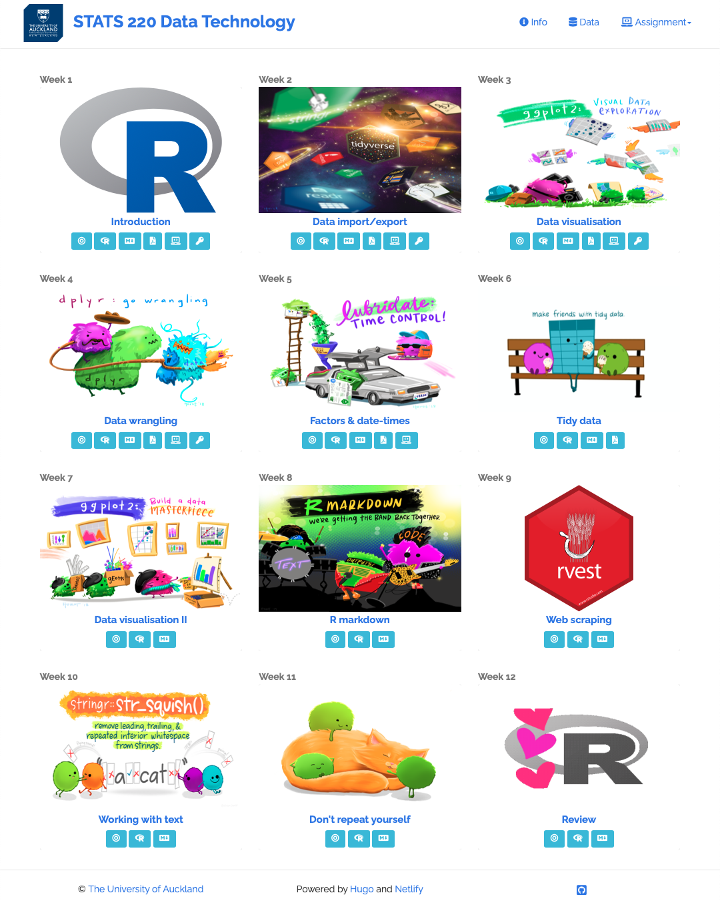
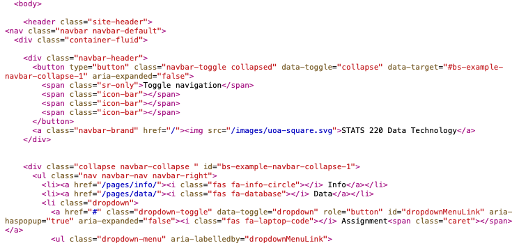
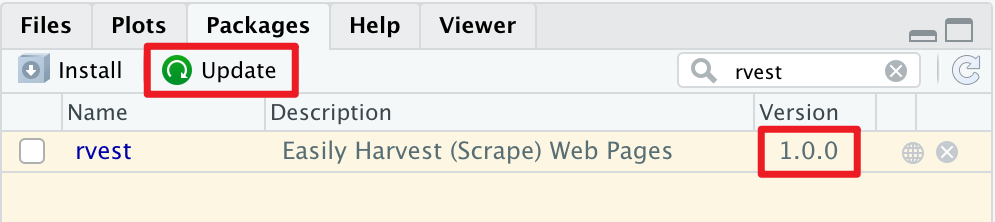
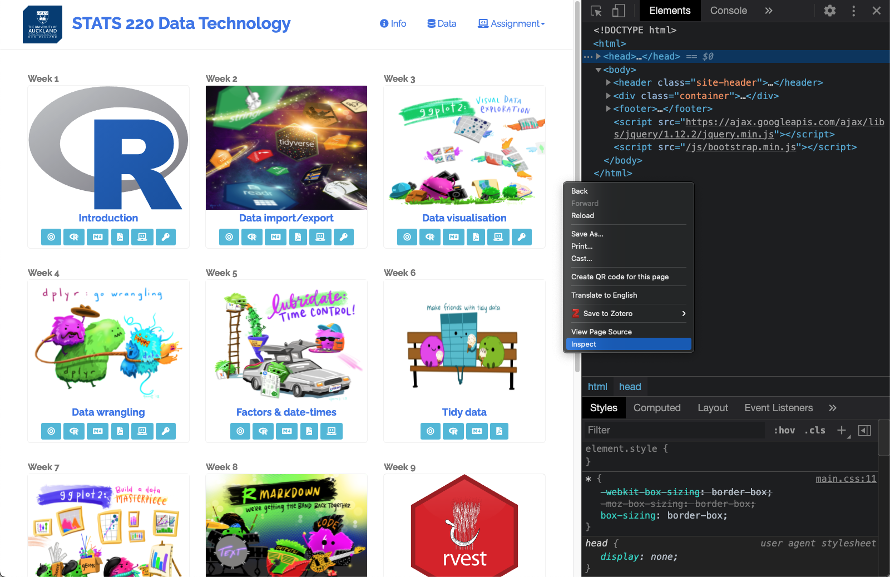
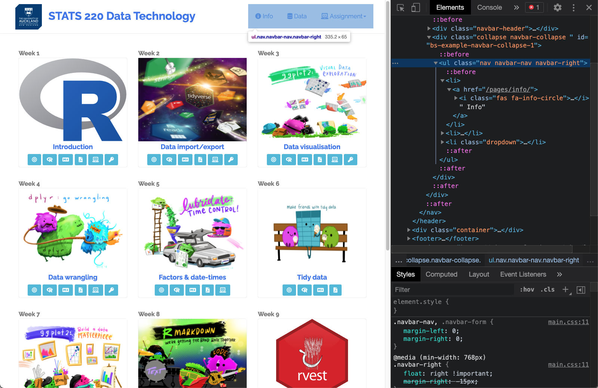
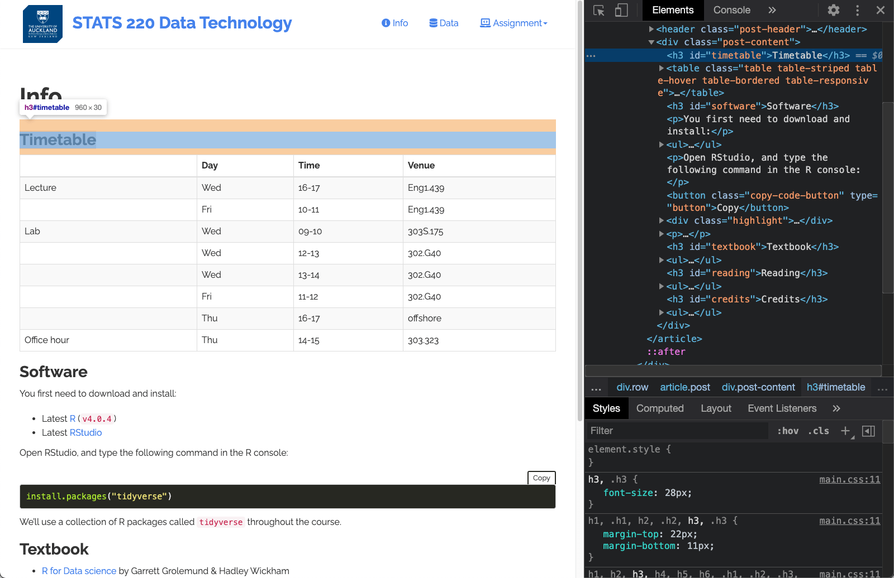
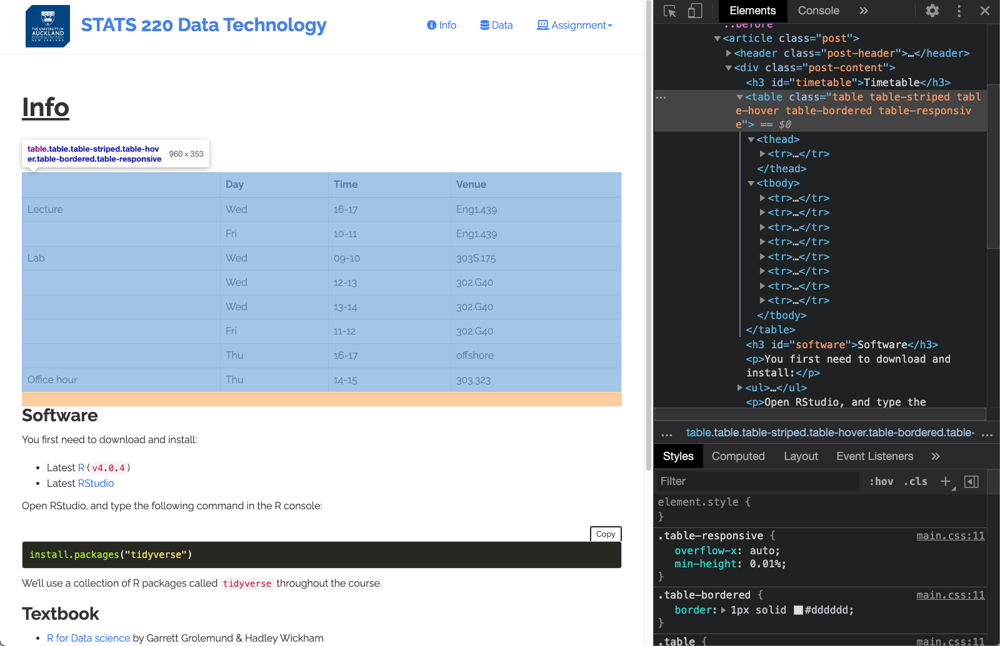

class: inverse middle

```{r initial, echo = FALSE, cache = FALSE, results = 'hide'}
library(knitr)
options(htmltools.dir.version = FALSE, htmltools.preserve.raw = FALSE, 
  tibble.width = 60, tibble.print_min = 6)
opts_chunk$set(
  echo = TRUE, warning = FALSE, message = FALSE, comment = "#>",
  fig.path = 'figure/', cache.path = 'cache/', cache = FALSE, fig.retina = 3,
  fig.align = 'center', fig.width = 4.5, fig.height = 4, fig.show = 'hold',
  dpi = 120
)
```

```{r xaringan-panelset, echo = FALSE}
xaringanExtra::use_panelset()
```

```{r external, include = FALSE, cache = FALSE}
read_chunk('R/09-web-scrape.R')
```

## Web technology <i class="fab fa-html5 orange"></i> <i class="fab fa-css3-alt blue"></i> <i class='fab fa-js-square yellow'></i>

.footnote[I thank [Dr Emi Tanaka](https://emitanaka.org/about.html) for this part, adapted from her "Communicating with Data" course.]

---

class: middle

## World Wide Web (WWW) 

WWW (or the **Web**) is the information system where documents (web pages) are identified by Uniform Resource Locators (**URL**s)

A web page consists of:
* <i class="fab fa-html5 orange"></i> **HTML** provides the basic structure of the web page
* <i class="fab fa-css3-alt blue"></i> **CSS** controls the look of the web page (optional)
* <i class='fab fa-js-square yellow'></i></span> **JS** is a programming language that can modify the behaviour of elements of the web page (optional) 

---

## <i class="fab fa-html5 orange"></i></span> Hypertext Markup Language (HTML)

* with the extension `.html`.
* rendered using a web browser via an URL.
* text files that follows a special syntax that alerts web browsers how to render it.
.pull-left[
.center[**via a web browser**
</img>
]
]
.pull-right[
.center[**via a text editor**
</img>
]
]

---

## <i class="fab fa-html5 orange"></i> HTML structure

```html
<!DOCTYPE html>

<html>
  <!--This is a comment and ignored by web client.-->
  <head>
    <!--This section contains web page metadata.-->
    <title>STATS 220 Data Technology</title>
    <meta name="author" content="Earo Wang">
    <link rel="stylesheet" href="css/styles.css">
  </head>

  <body>
    <!--This section contains what you want to display on your web page.-->
    <h1>I'm a first level header</h1>
    <p>This is a <b>paragraph</b>.</p>
  </body>
</html>
```

???

* servr::httd() to serve
* HTML: hier str: elements (`<tags>`) and optional attributes, and contents
* > 100 elements: each html page must have `<head>` and `<body>`. (rich format -> md)
* block tags: h1, p
* inline tags: bold a

---

## <i class="fab fa-html5 orange"></i> HTML syntax

.center[`<span style="color:blue;">Author content</span>` <i class="fas fa-arrow-right"></i> <span style="color:blue;">Author content</span>]

<table style="width:100%">
<tr>
<td style="text-align:right;padding-right:30px;">start tag:</td><td><span class="remark-code" style="font-size:16pt"><span class="red">&lt;span style="color:blue;"&gt;</span><span class="gray">Author content&lt;/span&gt;</span></span> </td>
</tr>
<tr>
<td style="text-align:right;padding-right:30px;">end tag: </td><td> <span class="remark-code" style="font-size:16pt"><span class="gray">&lt;span style="color:blue;"&gt;Author content<span class="red">&lt;/span&gt;</span></span> </td>
</tr>
<tr>
<td style="text-align:right;padding-right:30px;">content: </td><td> <span class="remark-code" style="font-size:16pt"><span class="gray">&lt;span style="color:blue;"&gt;</span><span class="red">Author content</span><span class="gray">&lt;/span&gt;</span></span> </td>
</tr>
<tr>
<td style="text-align:right;padding-right:30px;">element name: </td><td> <span class="remark-code" style="font-size:16pt"><span class="gray">&lt;</span><span class="red">span</span><span class="gray"> style="color:blue;"&gt;Author content&lt;/span&gt;</span></span> </td>
</tr>
<tr>
<td style="text-align:right;padding-right:30px;">attribute: </td><td> <span class="remark-code" style="font-size:16pt"><span class="gray">&lt;span <span class="red">style="color:blue;"</span><span class="gray">&gt;Author content&lt;/span&gt;</span> </td>
</tr>
<tr>
<td style="text-align:right;padding-right:30px;">attribute name: </td><td> <span class="remark-code" style="font-size:16pt"><span class="gray">&lt;span <span class="red">style</span><span class="gray">="color:blue;"&gt;Author content&lt;/span&gt;</span> </td>
</tr>
<tr>
<td style="text-align:right;padding-right:30px;">attribute value: </td><td> <span class="remark-code" style="font-size:16pt"><span class="gray">&lt;span style=</span><span class="red">"color:blue;"</span><span class="gray">&gt;Author content&lt;/span&gt;</span> </td>
</tr>
</table>

<hr>

.center[Not all HTML tags have an end tag:]

.center[
<span style="font-size:18pt;">``</span> <i class="fas fa-arrow-right"></i> 
]

---

## <i class="fab fa-html5 orange"></i> HTML elements

<table style="width:100%">
<tr>
<td style="text-align:right;padding-right:30px;">block element:</td><td><span class="remark-code red" style="font-size:16pt">&lt;div><span class="gray">content</span>&lt;/div></span></td>
</tr>
<tr>
<td style="text-align:right;padding-right:30px;">inline element:</td><td><span class="remark-code red" style="font-size:16pt">&lt;span><span class="gray">content</span>&lt;/span></span></td>
</tr>
<tr>
<td style="text-align:right;padding-right:30px;">paragraph:</td><td><span class="remark-code red" style="font-size:16pt">&lt;p><span class="gray">content</span>&lt;/p></span></td>
</tr>
<tr>
<td style="text-align:right;padding-right:30px;">header level 1:</td><td><span class="remark-code red" style="font-size:16pt">&lt;h1><span class="gray">content</span>&lt;/h1></span></td>
</tr>
<tr>
<td style="text-align:right;padding-right:30px;">header level 2:</td><td><span class="remark-code red" style="font-size:16pt">&lt;h2><span class="gray">content</span>&lt;/h2></span></td></td>
</tr>
<tr>
<td style="text-align:right;padding-right:30px;">italic:</td><td><span class="remark-code red" style="font-size:16pt">&lt;i><span class="gray">content</span>&lt;/i></span></td>
</tr>
<tr>
<td style="text-align:right;padding-right:30px;">emphasised text:</td><td><span class="remark-code red" style="font-size:16pt">&lt;em><span class="gray">content</span>&lt;/em></span></td>
</tr>
<tr>
<td style="text-align:right;padding-right:30px;">strong importance:</td><td><span class="remark-code red" style="font-size:16pt">&lt;strong><span class="gray">content</span>&lt;/strong></span></td>
</tr>
<tr>
<td style="text-align:right;padding-right:30px;">link:</td><td><span class="remark-code red" style="font-size:16pt">&lt;a href="https://stats220.earo.me/"><span class="gray">content</span>&lt;/a></span></td>
</tr>
<tr>
<td valign="top" style="text-align:right;padding-right:30px;">unordered list:</td><td><span class="remark-code red" style="font-size:16pt">&lt;ul><br>&lt;li><span class="gray">item 1</span>&lt;/li><Br>&lt;li><span class="gray">item 2</span>&lt;/li><Br>&lt;/ul></span></td>
</tr>
</table>

???

How these are rendered to the browser depends on the browser default style values, style attribute or CSS...

---

## <i class="fab fa-css3-alt blue"></i> Cascading Style Sheet (CSS)

* with the extension `.css`
* 3 ways to style elements in HTML:
  * **inline** by using the `style` attribute inside HTML start tag:
  <center>
  <span class="remark-code gray" style="font-size:14pt;">&lt;h1 <span class="red">style="color:blue;"</span>>Blue Header&lt;/h1></span>
  </center>
  + **externally** by using the `<link>` element:
  <center>
  <span class="remark-code red" style="font-size:14pt;">&lt;link rel="stylesheet" href="styles.css"></span>
  </center>
  + **internally** by defining within `<style>` element:

<div style="margin-left:35%; width:350px;">
```html
<style type="text/css">
h1 { color: blue; }
</style>
```
</div>
By convention, the `<style>` and `<link>` elements tend to go into the `<head>` section of the HTML document.

---

## <i class="fab fa-css3-alt blue"></i> CSS syntax

.pull-left[
```html
<style type="text/css">
h1 { color: blue; }
</style>
<h1>This is a header</h1>
```
]

<div style="margin-left:55%; width:350px;">
<br>
<h2 style="color:blue">This is a header</h2>
</div>

<table style="width:100%">
<tr>
<td style="text-align:right;padding-right:30px;">selector:</td><td><span class="remark-code" style="font-size:16pt"><span class="red">h1</span><span class="gray"> { color: blue; }</span></span> </td>
</tr>
<tr>
<td style="text-align:right;padding-right:30px;">property:</td><td><span class="remark-code gray" style="font-size:16pt;">h1 { <span class="red">color: blue;</span> }</span> </td>
</tr>
<tr>
<td style="text-align:right;padding-right:30px;">property name:</td><td><span class="remark-code gray" style="font-size:16pt;">h1 { <span class="red">color</span>: blue; } </span></td>
</tr>
<tr>
<td style="text-align:right;padding-right:30px;">property value:</td><td><span class="remark-code gray" style="font-size:16pt;">h1 { color: <span class="red">blue</span>; } </span></td>
</tr>
</table>

.pull-left[
You may have multiple properties for a single selector.`r emo::ji("arrow_right")`
]
.pull-right[
```css
h1 {
  color: blue;
  font-size: 16pt;
}
```
]

---

## <i class="fab fa-css3-alt blue"></i> CSS properties

.center[
```html
<div>Sample text</div>
```
]

<table style="width:100%">
<tr>
<td style="text-align:right;padding-right:30px;">background color:</td>
<td><span class="remark-code gray" style="font-size:16pt">div { <span class="red">background-color: yellow;</span> }</span> </td>
<td>
<div style="background-color: yellow;">Sample text</div>
</td>
</tr>
<tr>
<td style="text-align:right;padding-right:30px;">text color:</td>
<td><span class="remark-code gray" style="font-size:16pt">div { <span class="red">color: purple;</span> }</span> </td>
<td>
<div style="color: purple;">Sample text</div>
</td>
</tr>
<tr>
<td style="text-align:right;padding-right:30px;">border:</td>
<td><span class="remark-code gray" style="font-size:16pt">div { <span class="red">border: 1px dashed brown;</span> }</span> </td>
<td>
<div style="border: 1px dashed brown;">Sample text</div>
</td>
</tr>
<tr>
<td style="text-align:right;padding-right:30px;">left border only:</td>
<td><span class="remark-code gray" style="font-size:16pt">div { <span class="red">border-left: 10px solid pink;</span> }</span> </td>
<td>
<div style="border-left: 10px solid pink;">Sample text</div>
</td>
</tr>
<tr>
<td style="text-align:right;padding-right:30px;">text size:</td>
<td><span class="remark-code gray" style="font-size:16pt">div { <span class="red">font-size: 10pt;</span> }</span> </td>
<td>
<div style="font-size:10pt;">Sample text</div>
</td>
</tr>
<tr>
<td valign="top" style="text-align:right;padding-right:30px;">padding:</td>
<td  valign="top"><span class="remark-code gray" style="font-size:16pt">div { background-color: yellow; <br>
&emsp;&emsp;&emsp;&nbsp;<span class="red">padding: 10px;</span> }</span> </td>
<td>
<div style="background-color: yellow;padding:10px;">Sample text</div>
</td>
</tr>
<tr>
<td valign="top" style="text-align:right;padding-right:30px;">margin:</td>
<td  valign="top"><span class="remark-code gray" style="font-size:16pt">div { background-color: yellow; <br>
&emsp;&emsp;&emsp;&nbsp;<span class="red">margin: 10px;</span> }</span> </td>
<td>
<div style="background-color: yellow;margin:10px;">Sample text</div>
</td>
</tr>
</table>

---

## <i class="fab fa-css3-alt blue"></i> CSS properties

.center[
```html
<div>Sample text</div>
```
]

<table style="width:100%">
<tr>
<td valign="top" style="text-align:right;padding-right:30px;">center align text:</td>
<td  valign="top"><span class="remark-code gray" style="font-size:16pt">div { background-color: yellow; <br>
&emsp;&emsp;&emsp;&nbsp;padding-top: 20px;<br>
&emsp;&emsp;&emsp;&nbsp;<span class="red">text-align: center;</span> }</span> </td>
<td>
<div style="background-color: yellow;text-align: center;padding-top: 20px;">Sample text</div>
</td>
</tr>
<tr>
<td valign="top" style="text-align:right;padding-right:30px;">font family:</td>
<td  valign="top"><span class="remark-code gray" style="font-size:16pt">div { <span class="red">font-family: Marker Felt, times;</span> }</span> </td>
<td>
<div style="font-family: Marker Felt, times;">Sample text</div>
</td>
</tr>
<tr>
<td valign="top" style="text-align:right;padding-right:30px;">strike:</td>
<td  valign="top"><span class="remark-code gray" style="font-size:16pt">div { <span class="red">text-decoration: line-through;</span> }</span> </td>
<td>
<div style="text-decoration: line-through;">Sample text</div>
</td>
</tr>
<tr>
<td valign="top" style="text-align:right;padding-right:30px;">underline:</td>
<td  valign="top"><span class="remark-code gray" style="font-size:16pt">div { <span class="red">text-decoration: underline;</span> }</span> </td>
<td>
<div style="text-decoration: underline;">Sample text</div>
</td>
</tr>
<tr>
<td valign="top" style="text-align:right;padding-right:30px;">opacity:</td>
<td  valign="top"><span class="remark-code gray" style="font-size:16pt">div { <span class="red">opacity: 0.3</span> }</span> </td>
<td>
<div style="opacity: 0.3;">Sample text</div>
</td>
</tr>
</table>

---

count: false

.pull-left[
## <i class="fab fa-css3-alt blue"></i> CSS selector

<table class="gray" style="width:98%;margin-left:10px;margin-right:10px;">
<tr class="red">
<td class="remark-code">* </td><td>&nbsp;&nbsp;</td><td>selects all elements</td>
</tr>
<tr>
<td class="remark-code">div</td><td>&nbsp;&nbsp;</td><td>selects all <span class="remark-code" style="font-size:16pt">&lt;div></span> elements</td>
</tr>
<tr>
<td class="remark-code">div, p</td><td>&nbsp;&nbsp;</td><td>selects all <span class="remark-code" style="font-size:16pt">&lt;div></span> and <span class="remark-code" style="font-size:16pt">&lt;p></span> elements</td>
</tr>
<tr>
<td class="remark-code">div p</td><td>&nbsp;&nbsp;</td><td>selects all <span class="remark-code" style="font-size:16pt">&lt;p></span> within <span class="remark-code" style="font-size:16pt">&lt;div></span></td>
</tr>
<tr>
<td class="remark-code">div > p</td><td>&nbsp;&nbsp;</td><td>selects all <span class="remark-code" style="font-size:16pt">&lt;p></span> one level deep in <span class="remark-code" style="font-size:16pt">&lt;div></span></td>
</tr>
<tr valign="top">
<td class="remark-code">div + p</td><td>&nbsp;&nbsp;</td><td>selects all <span class="remark-code" style="font-size:16pt">&lt;p></span> immediately after a <span class="remark-code" style="font-size:16pt">&lt;div></span></td>
</tr>
<tr>
<td class="remark-code">div ~ p</td><td>&nbsp;&nbsp;</td><td>selects all <span class="remark-code" style="font-size:16pt">&lt;p></span> preceded by a <span class="remark-code" style="font-size:16pt">&lt;div></span></td>
</tr>
</table>
]
.pull-right[
<pre style="font-size: 13pt;" class="red">
&lt;h1>This is a sample html&lt;/h1>

&lt;blockquote>
&lt;p>Maybe stories are just data with a soul.&lt;/p>
&lt;footer>—Brene Brown&lt;/footer>
&lt;/blockquote>

&lt;div id="p1" class="parent">
Hmm
&lt;p>Hi!&lt;/p>
How are you? 
&lt;div class="child nice">
  &lt;p>Hello!&lt;/p>
&lt;/div>
&lt;/div>

&lt;p>Household 1&lt;/p>

&lt;div class="parent">
&lt;p>Hi!&lt;/p>
&lt;blockquote class="child rebel">
  &lt;p>Don't talk to me!&lt;/p>
&lt;/blockquote>
&lt;/div>

&lt;span class="child">
&lt;span class="parent child rebel">
  &lt;p>Clean your room!&lt;/p>
&lt;/span>
&lt;/span>

&lt;p>End of households&lt;/p>

</pre>
]

---

count: false

.pull-left[
## <i class="fab fa-css3-alt blue"></i> CSS selector

<table class="gray" style="width:98%;margin-left:10px;margin-right:10px;">
<tr >
<td class="remark-code">* </td><td>&nbsp;&nbsp;</td><td>selects all elements</td>
</tr>
<tr class="red">
<td class="remark-code">div</td><td>&nbsp;&nbsp;</td><td>selects all <span class="remark-code" style="font-size:16pt">&lt;div></span> elements</td>
</tr>
<tr>
<td class="remark-code">div, p</td><td>&nbsp;&nbsp;</td><td>selects all <span class="remark-code" style="font-size:16pt">&lt;div></span> and <span class="remark-code" style="font-size:16pt">&lt;p></span> elements</td>
</tr>
<tr>
<td class="remark-code">div p</td><td>&nbsp;&nbsp;</td><td>selects all <span class="remark-code" style="font-size:16pt">&lt;p></span> within <span class="remark-code" style="font-size:16pt">&lt;div></span></td>
</tr>
<tr>
<td class="remark-code">div > p</td><td>&nbsp;&nbsp;</td><td>selects all <span class="remark-code" style="font-size:16pt">&lt;p></span> one level deep in <span class="remark-code" style="font-size:16pt">&lt;div></span></td>
</tr>
<tr valign="top">
<td class="remark-code">div + p</td><td>&nbsp;&nbsp;</td><td>selects all <span class="remark-code" style="font-size:16pt">&lt;p></span> immediately after a <span class="remark-code" style="font-size:16pt">&lt;div></span></td>
</tr>
<tr>
<td class="remark-code">div ~ p</td><td>&nbsp;&nbsp;</td><td>selects all <span class="remark-code" style="font-size:16pt">&lt;p></span> preceded by a <span class="remark-code" style="font-size:16pt">&lt;div></span></td>
</tr>
</table>
]
.pull-right[
<pre style="font-size: 13pt">
&lt;h1>This is a sample html&lt;/h1>

&lt;blockquote>
&lt;p>Maybe stories are just data with a soul.&lt;/p>
&lt;footer>—Brene Brown&lt;/footer>
&lt;/blockquote>

<span class="red">&lt;div id="p1" class="parent">
Hmm
&lt;p>Hi!&lt;/p>
How are you? 
&lt;div class="child nice">
  &lt;p>Hello!&lt;/p>
&lt;/div>
&lt;/div></span>

&lt;p>Household 1&lt;/p>

<span class="red">&lt;div class="parent">
&lt;p>Hi!&lt;/p>
&lt;blockquote class="child rebel">
  &lt;p>Don't talk to me!&lt;/p>
&lt;/blockquote>
&lt;/div></span>

&lt;span class="child">
&lt;span class="parent child rebel">
  &lt;p>Clean your room!&lt;/p>
&lt;/span>
&lt;/span>

&lt;p>End of households&lt;/p>

</pre>
]

---

count: false

.pull-left[
## <i class="fab fa-css3-alt blue"></i> CSS selector

<table class="gray" style="width:98%;margin-left:10px;margin-right:10px;">
<tr >
<td class="remark-code">* </td><td>&nbsp;&nbsp;</td><td>selects all elements</td>
</tr>
<tr class="red">
<td class="remark-code">blockquote</td><td>&nbsp;&nbsp;</td><td>selects all <span class="remark-code" style="font-size:16pt">&lt;blockquote></span> elements</td>
</tr>
<tr>
<td class="remark-code">div, p</td><td>&nbsp;&nbsp;</td><td>selects all <span class="remark-code" style="font-size:16pt">&lt;div></span> and <span class="remark-code" style="font-size:16pt">&lt;p></span> elements</td>
</tr>
<tr>
<td class="remark-code">div p</td><td>&nbsp;&nbsp;</td><td>selects all <span class="remark-code" style="font-size:16pt">&lt;p></span> within <span class="remark-code" style="font-size:16pt">&lt;div></span></td>
</tr>
<tr>
<td class="remark-code">div > p</td><td>&nbsp;&nbsp;</td><td>selects all <span class="remark-code" style="font-size:16pt">&lt;p></span> one level deep in <span class="remark-code" style="font-size:16pt">&lt;div></span></td>
</tr>
<tr valign="top">
<td class="remark-code">div + p</td><td>&nbsp;&nbsp;</td><td>selects all <span class="remark-code" style="font-size:16pt">&lt;p></span> immediately after a <span class="remark-code" style="font-size:16pt">&lt;div></span></td>
</tr>
<tr>
<td class="remark-code">div ~ p</td><td>&nbsp;&nbsp;</td><td>selects all <span class="remark-code" style="font-size:16pt">&lt;p></span> preceded by a <span class="remark-code" style="font-size:16pt">&lt;div></span></td>
</tr>
</table>
]
.pull-right[
<pre style="font-size: 13pt">
&lt;h1>This is a sample html&lt;/h1>

<span class="red">&lt;blockquote>
&lt;p>Maybe stories are just data with a soul.&lt;/p>
&lt;footer>—Brene Brown&lt;/footer>
&lt;/blockquote></span>

&lt;div id="p1" class="parent">
Hmm
&lt;p>Hi!&lt;/p>
How are you? 
&lt;div class="child nice">
  &lt;p>Hello!&lt;/p>
&lt;/div>
&lt;/div>

&lt;p>Household 1&lt;/p>

&lt;div class="parent">
&lt;p>Hi!&lt;/p>
&lt;blockquote class="child rebel">
  &lt;p>Don't talk to me!&lt;/p>
&lt;/blockquote>
&lt;/div>

&lt;span class="child">
&lt;span class="parent child rebel">
  &lt;p>Clean your room!&lt;/p>
&lt;/span>
&lt;/span>

&lt;p>End of households&lt;/p>

</pre>
]

---

count: false

.pull-left[
## <i class="fab fa-css3-alt blue"></i> CSS selector

<table class="gray" style="width:98%;margin-left:10px;margin-right:10px;">
<tr >
<td class="remark-code">* </td><td>&nbsp;&nbsp;</td><td>selects all elements</td>
</tr>
<tr>
<td class="remark-code">div</td><td>&nbsp;&nbsp;</td><td>selects all <span class="remark-code" style="font-size:16pt">&lt;div></span> elements</td>
</tr>
<tr class="red">
<td class="remark-code">div, p</td><td>&nbsp;&nbsp;</td><td>selects all <span class="remark-code" style="font-size:16pt">&lt;div></span> and <span class="remark-code" style="font-size:16pt">&lt;p></span> elements</td>
</tr>
<tr>
<td class="remark-code">div p</td><td>&nbsp;&nbsp;</td><td>selects all <span class="remark-code" style="font-size:16pt">&lt;p></span> within <span class="remark-code" style="font-size:16pt">&lt;div></span></td>
</tr>
<tr>
<td class="remark-code">div > p</td><td>&nbsp;&nbsp;</td><td>selects all <span class="remark-code" style="font-size:16pt">&lt;p></span> one level deep in <span class="remark-code" style="font-size:16pt">&lt;div></span></td>
</tr>
<tr valign="top">
<td class="remark-code">div + p</td><td>&nbsp;&nbsp;</td><td>selects all <span class="remark-code" style="font-size:16pt">&lt;p></span> immediately after a <span class="remark-code" style="font-size:16pt">&lt;div></span></td>
</tr>
<tr>
<td class="remark-code">div ~ p</td><td>&nbsp;&nbsp;</td><td>selects all <span class="remark-code" style="font-size:16pt">&lt;p></span> preceded by a <span class="remark-code" style="font-size:16pt">&lt;div></span></td>
</tr>
<tr>
</table>
]
.pull-right[
<pre style="font-size: 13pt">
&lt;h1>This is a sample html&lt;/h1>

&lt;blockquote>
<span class="red">&lt;p>Maybe stories are just data with a soul.&lt;/p></span>
&lt;footer>—Brene Brown&lt;/footer>
&lt;/blockquote>

<span class="red">&lt;div id="p1" class="parent">
Hmm
&lt;p>Hi!&lt;/p>
How are you? 
&lt;div class="child nice">
  &lt;p>Hello!&lt;/p>
&lt;/div>
&lt;/div></span>

<span class="red">&lt;p>Household 1&lt;/p></span>

<span class="red">&lt;div class="parent">
&lt;p>Hi!&lt;/p>
&lt;blockquote class="child rebel">
  &lt;p>Don't talk to me!&lt;/p>
&lt;/span>
&lt;/div></span>

&lt;span class="child">
&lt;span class="parent child rebel">
  <span class="red">&lt;p>Clean your room!&lt;/p></span>
&lt;/span>
&lt;/span>

<span class="red">&lt;p>End of households&lt;/p></span>

</pre>
]

---

count: false

.pull-left[
## <i class="fab fa-css3-alt blue"></i> CSS selector

<table class="gray" style="width:98%;margin-left:10px;margin-right:10px;">
<tr >
<td class="remark-code">* </td><td>&nbsp;&nbsp;</td><td>selects all elements</td>
</tr>
<tr>
<td class="remark-code">div</td><td>&nbsp;&nbsp;</td><td>selects all <span class="remark-code" style="font-size:16pt">&lt;div></span> elements</td>
</tr>
<tr>
<td class="remark-code">div, p</td><td>&nbsp;&nbsp;</td><td>selects all <span class="remark-code" style="font-size:16pt">&lt;div></span> and <span class="remark-code" style="font-size:16pt">&lt;p></span> elements</td>
</tr>
<tr class="red">
<td class="remark-code">div p</td><td>&nbsp;&nbsp;</td><td>selects all <span class="remark-code" style="font-size:16pt">&lt;p></span> within <span class="remark-code" style="font-size:16pt">&lt;div></span></td>
</tr>
<tr>
<td class="remark-code">div > p</td><td>&nbsp;&nbsp;</td><td>selects all <span class="remark-code" style="font-size:16pt">&lt;p></span> one level deep in <span class="remark-code" style="font-size:16pt">&lt;div></span></td>
</tr>
<tr valign="top">
<td class="remark-code">div + p</td><td>&nbsp;&nbsp;</td><td>selects all <span class="remark-code" style="font-size:16pt">&lt;p></span> immediately after a <span class="remark-code" style="font-size:16pt">&lt;div></span></td>
</tr>
<tr>
<td class="remark-code">div ~ p</td><td>&nbsp;&nbsp;</td><td>selects all <span class="remark-code" style="font-size:16pt">&lt;p></span> preceded by a <span class="remark-code" style="font-size:16pt">&lt;div></span></td>
</tr>
<tr>
</table>
]
.pull-right[
<pre style="font-size: 13pt">
&lt;h1>This is a sample html&lt;/h1>

&lt;blockquote>
&lt;p>Maybe stories are just data with a soul.&lt;/p>
&lt;footer>—Brene Brown&lt;/footer>
&lt;/blockquote>

&lt;div id="p1" class="parent">
Hmm
<span class="red">&lt;p>Hi!&lt;/p></span>
How are you? 
&lt;div class="child nice">
  <span class="red">&lt;p>Hello!&lt;/p></span>
&lt;/div>
&lt;/div>

&lt;p>Household 1&lt;/p>

&lt;div class="parent">
<span class="red">&lt;p>Hi!&lt;/p></span>
&lt;blockquote class="child rebel">
  <span class="red">&lt;p>Don't talk to me!&lt;/p></span>
&lt;/blockquote>
&lt;/div>

&lt;span class="child">
&lt;span class="parent child rebel">
  &lt;p>Clean your room!&lt;/p>
&lt;/span>
&lt;/span>

&lt;p>End of households&lt;/p>

</pre>
]

---

count: false

.pull-left[
## <i class="fab fa-css3-alt blue"></i> CSS selector

<table class="gray" style="width:98%;margin-left:10px;margin-right:10px;">
<tr >
<td class="remark-code">* </td><td>&nbsp;&nbsp;</td><td>selects all elements</td>
</tr>
<tr>
<td class="remark-code">div</td><td>&nbsp;&nbsp;</td><td>selects all <span class="remark-code" style="font-size:16pt">&lt;div></span> elements</td>
</tr>
<tr>
<td class="remark-code">div, p</td><td>&nbsp;&nbsp;</td><td>selects all <span class="remark-code" style="font-size:16pt">&lt;div></span> and <span class="remark-code" style="font-size:16pt">&lt;p></span> elements</td>
</tr>
<tr class="red">
<td class="remark-code">p div</td><td>&nbsp;&nbsp;</td><td>selects all <span class="remark-code" style="font-size:16pt">&lt;div></span> within <span class="remark-code" style="font-size:16pt">&lt;p></span></td>
</tr>
<tr>
<td class="remark-code">div > p</td><td>&nbsp;&nbsp;</td><td>selects all <span class="remark-code" style="font-size:16pt">&lt;p></span> one level deep in <span class="remark-code" style="font-size:16pt">&lt;div></span></td>
</tr>
<tr valign="top">
<td class="remark-code">div + p</td><td>&nbsp;&nbsp;</td><td>selects all <span class="remark-code" style="font-size:16pt">&lt;p></span> immediately after a <span class="remark-code" style="font-size:16pt">&lt;div></span></td>
</tr>
<tr>
<td class="remark-code">div ~ p</td><td>&nbsp;&nbsp;</td><td>selects all <span class="remark-code" style="font-size:16pt">&lt;p></span> preceded by a <span class="remark-code" style="font-size:16pt">&lt;div></span></td>
</tr>
<tr>
</table>
]
.pull-right[
<pre style="font-size: 13pt">
&lt;h1>This is a sample html&lt;/h1>

&lt;blockquote>
&lt;p>Maybe stories are just data with a soul.&lt;/p>
&lt;footer>—Brene Brown&lt;/footer>
&lt;/blockquote>

&lt;div id="p1" class="parent">
Hmm
&lt;p>Hi!&lt;/p>
How are you? 
&lt;div class="child nice">
  &lt;p>Hello!&lt;/p>
&lt;/div>
&lt;/div>

&lt;p>Household 1&lt;/p>

&lt;div class="parent">
&lt;p>Hi!&lt;/p>
&lt;blockquote class="child rebel">
  &lt;p>Don't talk to me!&lt;/p>
&lt;/blockquote>
&lt;/div>

&lt;span class="child">
&lt;span class="parent child rebel">
  &lt;p>Clean your room!&lt;/p>
&lt;/span>
&lt;/span>

&lt;p>End of households&lt;/p>

</pre>
]

---

count: false

.pull-left[
## <i class="fab fa-css3-alt blue"></i> CSS selector

<table class="gray" style="width:98%;margin-left:10px;margin-right:10px;">
<tr >
<td class="remark-code">* </td><td>&nbsp;&nbsp;</td><td>selects all elements</td>
</tr>
<tr>
<td class="remark-code">div</td><td>&nbsp;&nbsp;</td><td>selects all <span class="remark-code" style="font-size:16pt">&lt;div></span> elements</td>
</tr>
<tr>
<td class="remark-code">div, p</td><td>&nbsp;&nbsp;</td><td>selects all <span class="remark-code" style="font-size:16pt">&lt;div></span> and <span class="remark-code" style="font-size:16pt">&lt;p></span> elements</td>
</tr>
<tr >
<td class="remark-code">div p</td><td>&nbsp;&nbsp;</td><td>selects all <span class="remark-code" style="font-size:16pt">&lt;p></span> within <span class="remark-code" style="font-size:16pt">&lt;div></span></td>
</tr>
<tr class="red">
<td class="remark-code">div > p</td><td>&nbsp;&nbsp;</td><td>selects all <span class="remark-code" style="font-size:16pt">&lt;p></span> one level deep in <span class="remark-code" style="font-size:16pt">&lt;div></span></td>
</tr>
<tr valign="top">
<td class="remark-code">div + p</td><td>&nbsp;&nbsp;</td><td>selects all <span class="remark-code" style="font-size:16pt">&lt;p></span> immediately after a <span class="remark-code" style="font-size:16pt">&lt;div></span></td>
</tr>
<tr>
<td class="remark-code">div ~ p</td><td>&nbsp;&nbsp;</td><td>selects all <span class="remark-code" style="font-size:16pt">&lt;p></span> preceded by a <span class="remark-code" style="font-size:16pt">&lt;div></span></td>
</tr>
<tr>
</table>
]
.pull-right[
<pre style="font-size: 13pt">
&lt;h1>This is a sample html&lt;/h1>

&lt;blockquote>
&lt;p>Maybe stories are just data with a soul.&lt;/p>
&lt;footer>—Brene Brown&lt;/footer>
&lt;/blockquote>

&lt;div id="p1" class="parent">
Hmm
<span class="red">&lt;p>Hi!&lt;/p></span>
How are you? 
&lt;div class="child nice">
  <span class="red">&lt;p>Hello!&lt;/p></span>
&lt;/div>
&lt;/div>

&lt;p>Household 1&lt;/p>

&lt;div class="parent">
<span class="red">&lt;p>Hi!&lt;/p></span>
&lt;blockquote class="child rebel">
  &lt;p>Don't talk to me!&lt;/p>
&lt;/blockquote>
&lt;/div>

&lt;span class="child">
&lt;span class="parent child rebel">
  &lt;p>Clean your room!&lt;/p>
&lt;/span>
&lt;/span>

&lt;p>End of households&lt;/p>

</pre>
]

<div style="position:absolute;top:10px;left:900px;width:300px;background-color:white;border:1px solid black;font-size:16pt;padding:2px;">
<i class="fas fa-exclamation-triangle"></i> Ignores inline elements like <code>span</code>, <code>i</code>, <code>b</code>,...
</div>


---

count: false

.pull-left[
## <i class="fab fa-css3-alt blue"></i> CSS selector

<table class="gray" style="width:98%;margin-left:10px;margin-right:10px;">
<tr >
<td class="remark-code">* </td><td>&nbsp;&nbsp;</td><td>selects all elements</td>
</tr>
<tr>
<td class="remark-code">div</td><td>&nbsp;&nbsp;</td><td>selects all <span class="remark-code" style="font-size:16pt">&lt;div></span> elements</td>
</tr>
<tr>
<td class="remark-code">div, p</td><td>&nbsp;&nbsp;</td><td>selects all <span class="remark-code" style="font-size:16pt">&lt;div></span> and <span class="remark-code" style="font-size:16pt">&lt;p></span> elements</td>
</tr>
<tr >
<td class="remark-code">div p</td><td>&nbsp;&nbsp;</td><td>selects all <span class="remark-code" style="font-size:16pt">&lt;p></span> within <span class="remark-code" style="font-size:16pt">&lt;div></span></td>
</tr>
<tr>
<td class="remark-code">div > p</td><td>&nbsp;&nbsp;</td><td>selects all <span class="remark-code" style="font-size:16pt">&lt;p></span> one level deep in <span class="remark-code" style="font-size:16pt">&lt;div></span></td>
</tr>
<tr  valign="top" class="red">
<td class="remark-code">div + p</td><td>&nbsp;&nbsp;</td><td>selects all <span class="remark-code" style="font-size:16pt">&lt;p></span> immediately after a <span class="remark-code" style="font-size:16pt">&lt;div></span></td>
</tr>
<tr>
<td class="remark-code">div ~ p</td><td>&nbsp;&nbsp;</td><td>selects all <span class="remark-code" style="font-size:16pt">&lt;p></span> preceded by a <span class="remark-code" style="font-size:16pt">&lt;div></span></td>
</tr>
<tr>
</table>
]
.pull-right[
<pre style="font-size: 13pt">
&lt;h1>This is a sample html&lt;/h1>

&lt;blockquote>
&lt;p>Maybe stories are just data with a soul.&lt;/p>
&lt;footer>—Brene Brown&lt;/footer>
&lt;/blockquote>

&lt;div id="p1" class="parent">
Hmm
&lt;p>Hi!&lt;/p>
How are you? 
&lt;div class="child nice">
  &lt;p>Hello!&lt;/p>
&lt;/div>
&lt;/div>

<span class="red">&lt;p>Household 1&lt;/p></span>

&lt;div class="parent">
&lt;p>Hi!&lt;/p>
&lt;blockquote class="child rebel">
  &lt;p>Don't talk to me!&lt;/p>
&lt;/blockquote>
&lt;/div>

&lt;span class="child">
&lt;span class="parent child rebel">
  <span class="red">&lt;p>Clean your room!&lt;/p></span>
&lt;/span>
&lt;/span>

&lt;p>End of households&lt;/p>

</pre>
]

<div style="position:absolute;top:10px;left:900px;width:300px;background-color:white;border:1px solid black;font-size:16pt;padding:2px;">
<i class="fas fa-exclamation-triangle"></i> Ignores inline elements like <code>span</code>, <code>i</code>, <code>b</code>,...
</div>

---

count: false

.pull-left[
## <i class="fab fa-css3-alt blue"></i> CSS selector

<table class="gray" style="width:98%;margin-left:10px;margin-right:10px;">
<tr >
<td class="remark-code">* </td><td>&nbsp;&nbsp;</td><td>selects all elements</td>
</tr>
<tr>
<td class="remark-code">div</td><td>&nbsp;&nbsp;</td><td>selects all <span class="remark-code" style="font-size:16pt">&lt;div></span> elements</td>
</tr>
<tr>
<td class="remark-code">div, p</td><td>&nbsp;&nbsp;</td><td>selects all <span class="remark-code" style="font-size:16pt">&lt;div></span> and <span class="remark-code" style="font-size:16pt">&lt;p></span> elements</td>
</tr>
<tr >
<td class="remark-code">div p</td><td>&nbsp;&nbsp;</td><td>selects all <span class="remark-code" style="font-size:16pt">&lt;p></span> within <span class="remark-code" style="font-size:16pt">&lt;div></span></td>
</tr>
<tr>
<td class="remark-code">div > p</td><td>&nbsp;&nbsp;</td><td>selects all <span class="remark-code" style="font-size:16pt">&lt;p></span> one level deep in <span class="remark-code" style="font-size:16pt">&lt;div></span></td>
</tr>
<tr>
<td class="remark-code">div + p</td><td>&nbsp;&nbsp;</td><td>selects all <span class="remark-code" style="font-size:16pt">&lt;p></span> immediately after a <span class="remark-code" style="font-size:16pt">&lt;div></span></td>
</tr>
<tr class="red">
<td class="remark-code">div ~ p</td><td>&nbsp;&nbsp;</td><td>selects all <span class="remark-code" style="font-size:16pt">&lt;p></span> preceded by a <span class="remark-code" style="font-size:16pt">&lt;div></span></td>
</tr>
</table>
]
.pull-right[
<pre style="font-size: 13pt">
&lt;h1>This is a sample html&lt;/h1>

&lt;blockquote>
&lt;p>Maybe stories are just data with a soul.&lt;/p>
&lt;footer>—Brene Brown&lt;/footer>
&lt;/blockquote>

&lt;div id="p1" class="parent">
Hmm
&lt;p>Hi!&lt;/p>
How are you? 
&lt;div class="child nice">
  &lt;p>Hello!&lt;/p>
&lt;/div>
&lt;/div>

<span class="red">&lt;p>Household 1&lt;/p></span>

&lt;div class="parent">
&lt;p>Hi!&lt;/p>
&lt;blockquote class="child rebel">
  &lt;p>Don't talk to me!&lt;/p>
&lt;/blockquote>
&lt;/div>

&lt;span class="child">
&lt;span class="parent child rebel">
  <span class="red">&lt;p>Clean your room!&lt;/p></span>
&lt;/span>
&lt;/span>

<span class="red">&lt;p>End of households&lt;/p></span>

</pre>
]

---

count: false

.pull-left[
## <i class="fab fa-css3-alt blue"></i> CSS selector

<table class="gray" style="width:98%;margin-left:10px;margin-right:10px;">
<tr>
<td class="remark-code" valign="top">.classname</td><td>&nbsp;&nbsp;</td><td>selects all elements with the attribute <span class="remark-code" style="font-size:16pt">class="classname"</span>. </td>
</tr>
<tr>
<td class="remark-code" valign="top">.c1.c2</td><td>&nbsp;&nbsp;</td><td>selects all elements with <em>both</em> <span class="remark-code" style="font-size:16pt">c1</span> and <span class="remark-code" style="font-size:16pt">c2</span> within its class attribute. </td>
</tr>
<tr>
<td class="remark-code" valign="top">.c1 .c2</td><td>&nbsp;&nbsp;</td><td>selects all elements with  class <span class="remark-code" style="font-size:16pt">c2</span> that is a descendant of an element with class <span class="remark-code" style="font-size:16pt">c1</span>. </td>
</tr>
<tr>
<td class="remark-code" valign="top">#idname</td><td>&nbsp;&nbsp;</td><td>selects all elements with the attribute <span class="remark-code" style="font-size:16pt">id="idname"</span>. </td>
</tr>
</table>
]
.pull-right[
<pre style="font-size: 13pt">
&lt;h1>This is a sample html&lt;/h1>

&lt;blockquote>
&lt;p>Maybe stories are just data with a soul.&lt;/p>
&lt;footer>—Brene Brown&lt;/footer>
&lt;/blockquote>

&lt;div id="p1" class="parent">
Hmm
&lt;p>Hi!&lt;/p>
How are you? 
&lt;div class="child nice">
  &lt;p>Hello!&lt;/p>
&lt;/div>
&lt;/div>

&lt;p>Household 1&lt;/p>

&lt;div class="parent">
&lt;p>Hi!&lt;/p>
&lt;blockquote class="child rebel">
  &lt;p>Don't talk to me!&lt;/p>
&lt;/blockquote>
&lt;/div>

&lt;span class="child">
&lt;span class="parent child rebel"></span>
  &lt;p>Clean your room!&lt;/p>
&lt;/span></span>
&lt;/span>

&lt;p>End of households&lt;/p>

</pre>
]

---

count: false

.pull-left[
## <i class="fab fa-css3-alt blue"></i> CSS selector

<table class="gray" style="width:98%;margin-left:10px;margin-right:10px;">
<tr class="red">
<td class="remark-code" valign="top">.parent</td><td>&nbsp;&nbsp;</td><td>selects all elements with the attribute <span class="remark-code" style="font-size:16pt">class="parent"</span>. </td>
</tr>
<tr>
<td class="remark-code" valign="top">.c1.c2</td><td>&nbsp;&nbsp;</td><td>selects all elements with <em>both</em> <span class="remark-code" style="font-size:16pt">c1</span> and <span class="remark-code" style="font-size:16pt">c2</span> within its class attribute. </td>
</tr>
<tr>
<td class="remark-code" valign="top">.c1 .c2</td><td>&nbsp;&nbsp;</td><td>selects all elements with  class <span class="remark-code" style="font-size:16pt">c2</span> that is a descendant of an element with class <span class="remark-code" style="font-size:16pt">c1</span>. </td>
</tr>
<tr>
<td class="remark-code" valign="top">#idname</td><td>&nbsp;&nbsp;</td><td>selects all elements with the attribute <span class="remark-code" style="font-size:16pt">id="idname"</span>. </td>
</tr>
</table>

<div style="position:absolute;top:10px;left:900px;width:300px;background-color:white;border:1px solid black;font-size:16pt;padding:2px;">
<i class="fas fa-exclamation-triangle"></i> Note some offspring do not inherit class from their parents.
</div>
]
.pull-right[
<pre style="font-size: 13pt">
&lt;h1>This is a sample html&lt;/h1>

&lt;blockquote>
&lt;p>Maybe stories are just data with a soul.&lt;/p>
&lt;footer>—Brene Brown&lt;/footer>
&lt;/blockquote>

<span class="red">&lt;div id="p1" class="parent">
Hmm
&lt;p>Hi!&lt;/p>
How are you? 
&lt;div class="child nice">
  &lt;p>Hello!&lt;/p>
&lt;/div>
&lt;/div></span>

&lt;p>Household 1&lt;/p>

<span class="red">&lt;div class="parent">
&lt;p>Hi!&lt;/p>
&lt;blockquote class="child rebel">
  &lt;p>Don't talk to me!&lt;/p>
&lt;/blockquote>
&lt;/div></span>

&lt;span class="child">
<span class="red">&lt;span class="parent child rebel"></span>
  &lt;p>Clean your room!&lt;/p>
<span class="red">&lt;/span></span>
&lt;/span>

&lt;p>End of households&lt;/p>

</pre>
]

---

count: false

.pull-left[
## <i class="fab fa-css3-alt blue"></i> CSS selector

<table class="gray" style="width:98%;margin-left:10px;margin-right:10px;">
<td class="remark-code" valign="top">.classname</td><td>&nbsp;&nbsp;</td><td>selects all elements with the attribute <span class="remark-code" style="font-size:16pt">class="classname"</span>. </td>
</tr>
<tr class="red">
<td class="remark-code" valign="top">.child.rebel</td><td>&nbsp;&nbsp;</td><td>selects all elements with <em>both</em> <span class="remark-code" style="font-size:16pt">child</span> and <span class="remark-code" style="font-size:16pt">rebel</span> within its class attribute. </td>
</tr>
<tr>
<td class="remark-code" valign="top">.c1 .c2</td><td>&nbsp;&nbsp;</td><td>selects all elements with  class <span class="remark-code" style="font-size:16pt">c2</span> that is a descendant of an element with class <span class="remark-code" style="font-size:16pt">c1</span>. </td>
</tr>
<tr>
<td class="remark-code" valign="top">#idname</td><td>&nbsp;&nbsp;</td><td>selects all elements with the attribute <span class="remark-code" style="font-size:16pt">id="idname"</span>. </td>
</tr>
</table>
]
.pull-right[
<pre style="font-size: 13pt">
&lt;h1>This is a sample html&lt;/h1>

&lt;blockquote>
&lt;p>Maybe stories are just data with a soul.&lt;/p>
&lt;footer>—Brene Brown&lt;/footer>
&lt;/blockquote>

&lt;div id="p1" class="parent">
Hmm
&lt;p>Hi!&lt;/p>
How are you?
&lt;div class="child nice">
  &lt;p>Hello!&lt;/p>
&lt;/div>
&lt;/div>

&lt;p>Household 1&lt;/p>

&lt;div class="parent">
&lt;p>Hi!&lt;/p>
<span class="red">&lt;blockquote class="child rebel">
  &lt;p>Don't talk to me!&lt;/p>
&lt;/blockquote></span>
&lt;/div>

&lt;span class="child">
<span class="red">&lt;span class="parent child rebel"></span>
  &lt;p>Clean your room!&lt;/p>
<span class="red">&lt;/span></span>
&lt;/span>

&lt;p>End of households&lt;/p>

</pre>
]

---

count: false

.pull-left[
## <i class="fab fa-css3-alt blue"></i> CSS selector

<table class="gray" style="width:98%;margin-left:10px;margin-right:10px;">
<tr>
<td class="remark-code" valign="top">.classname</td><td>&nbsp;&nbsp;</td><td>selects all elements with the attribute <span class="remark-code" style="font-size:16pt">class="classname"</span>. </td>
</tr>
<tr>
<td class="remark-code" valign="top">.c1.c2</td><td>&nbsp;&nbsp;</td><td>selects all elements with <em>both</em> <span class="remark-code" style="font-size:16pt">c1</span> and <span class="remark-code" style="font-size:16pt">c2</span> within its class attribute. </td>
</tr>
<tr class="red">
<td class="remark-code" valign="top">.parent .rebel</td><td>&nbsp;&nbsp;</td><td>selects all elements with  class <span class="remark-code" style="font-size:16pt">rebel</span> that is a descendant of an element with class <span class="remark-code" style="font-size:16pt">parent</span>. </td>
</tr>
<tr>
<td class="remark-code" valign="top">#idname</td><td>&nbsp;&nbsp;</td><td>selects all elements with the attribute <span class="remark-code" style="font-size:16pt">id="idname"</span>. </td>
</tr>
</table>
]
.pull-right[
<pre style="font-size: 13pt">
&lt;h1>This is a sample html&lt;/h1>

&lt;blockquote>
&lt;p>Maybe stories are just data with a soul.&lt;/p>
&lt;footer>—Brene Brown&lt;/footer>
&lt;/blockquote>

&lt;div id="p1" class="parent">
Hmm
&lt;p>Hi!&lt;/p>
How are you?
&lt;div class="child nice">
  &lt;p>Hello!&lt;/p>
&lt;/div>
&lt;/div>

&lt;p>Household 1&lt;/p>

&lt;div class="parent">
&lt;p>Hi!&lt;/p>
<span class="red">&lt;blockquote class="child rebel">
  &lt;p>Don't talk to me!&lt;/p>
&lt;/blockquote></span>
&lt;/div>

&lt;span class="child">
&lt;span class="parent child rebel">
  &lt;p>Clean your room!&lt;/p>
&lt;/span>
&lt;/span>

&lt;p>End of households&lt;/p>

</pre>
]

---

count: false

.pull-left[
## <i class="fab fa-css3-alt blue"></i> CSS selector

<table class="gray" style="width:98%;margin-left:10px;margin-right:10px;">
<td class="remark-code" valign="top">.classname</td><td>&nbsp;&nbsp;</td><td>selects all elements with the attribute <span class="remark-code" style="font-size:16pt">class="classname"</span>. </td>
</tr>
<tr>
<td class="remark-code" valign="top">.c1.c2</td><td>&nbsp;&nbsp;</td><td>selects all elements with <em>both</em> <span class="remark-code" style="font-size:16pt">c1</span> and <span class="remark-code" style="font-size:16pt">c2</span> within its class attribute. </td>
</tr>
<tr>
<td class="remark-code" valign="top">.c1 .c2</td><td>&nbsp;&nbsp;</td><td>selects all elements with  class <span class="remark-code" style="font-size:16pt">c2</span> that is a descendant of an element with class <span class="remark-code" style="font-size:16pt">c1</span>. </td>
</tr>
<tr class="red">
<td class="remark-code" valign="top">#p1</td><td>&nbsp;&nbsp;</td><td>selects all elements with the attribute <span class="remark-code" style="font-size:16pt">id="p1"</span>. </td>
</tr>
</table>
]
.pull-right[
<pre style="font-size: 13pt">
&lt;h1>This is a sample html&lt;/h1>

&lt;blockquote>
&lt;p>Maybe stories are just data with a soul.&lt;/p>
&lt;footer>—Brene Brown&lt;/footer>
&lt;/blockquote>

<span class="red">&lt;div id="p1" class="parent">
Hmm
&lt;p>Hi!&lt;/p>
How are you?
&lt;div class="child nice">
  &lt;p>Hello!&lt;/p>
&lt;/div>
&lt;/div></span>

&lt;p>Household 1&lt;/p>

&lt;div class="parent">
&lt;p>Hi!&lt;/p>
&lt;blockquote class="child rebel">
  &lt;p>Don't talk to me!&lt;/p>
&lt;/blockquote>
&lt;/div>

&lt;span class="child">
&lt;span class="parent child rebel">
  &lt;p>Clean your room!&lt;/p>
&lt;/span>
&lt;/span>

&lt;p>End of households&lt;/p>

</pre>
]

<div style="position:absolute;top:10px;left:900px;width:300px;background-color:white;border:1px solid black;font-size:16pt;padding:2px;">
<i class="fas fa-exclamation-triangle"></i> Unlike <code style="font-size:16pt">class</code>, you can only have one <code style="font-size:16pt">id</code> value and must be unique in the whole HTML document.
</div>

---

## <i class='fab fa-js-square yellow'></i> JavaScript (JS)*

* JS is a programming language and enable interactive components in HTML documents.
* 2 ways to insert JS into a HTML document:
  + **internally** by defining within `<script>` element:
  ```html
  <script>
  document.getElementById("p1").innerHTML = "content";
  </script>
  ```
  + **externally** by using the `src` attribute to refer to the external file:
  ```html
  <script src="js/myjs.js"></script>
  ```

---

class: inverse middle

## Web scraping `r emo::ji("spider_web")`

---

```{r opts0, echo = FALSE}
op <- options(width = 40)
```

.pull-left[
.center[</img>]
]
.pull-right[
Use {rvest} `>= v1.0.0` (if not, update)


```{r read-html}
```
]

---

.pull-left[
## <i class="fas fa-search-plus"></i> Inspect elements
<br>
<br>
.center[</img>]
]
.pull-right[
## <i class="fas fa-puzzle-piece"></i> [CSS selectors](https://selectorgadget.com/)
<br>
<br>
.center[</img>]
]

---

.pull-left[
<br>
<br>
<br>
.center[</img>]
]
.pull-right[
`html_element()` select element
```{r html-el}
```
`html_name()` get element name
```{r html-nm}
```
]

---

.pull-left[
<br>
<br>
<br>
.center[</img>]
]
.pull-right[
`html_children()` get element children
```{r html-child}
```
`html_name()` get element name
```{r html-child-nm}
```
]

---

.pull-left[
<br>
<br>
<br>
.center[</img>]
]
.pull-right[
`html_text2()` get element text
```{r html-text}
```
`html_attr()` get element attributes
```{r html-attr}
```
]

---

## `url_absolute()`: turn relative urls to absolute urls

```{r html-url}
```

---

.pull-left[
<br>
<br>
<br>
.center[</img>]
]
.pull-right[
`html_elements()` select elements
```{r html-el-i}
```
`r emo::ji("arrow_up")` [fontawesome](http://fontawesome.com) icons

]

---

.pull-left[
<br>

```{r html-info}
```
.center[</img>]
]
.pull-right[
select all `<h3>` elements
```{r html-h3}
```
select `#timetable` id
```{r html-id}
```
]

---

.pull-left[
<br>
<br>
<br>
.center[</img>]
]
.pull-right[
select the first `<table>` element
```{r html-table}
```
]

???

* table on the web primarily for presentation purpose, not data storage
* isn't clean from web scraping

---

## Download pdf slides at once

```{r links}
```

---

## Download pdf slides at once

```{r pdf-links}
```

```{r pdf-links-dl, eval = FALSE}
```

---

class: inverse middle

## REST API

---

## <i class="fab fa-github"></i> [Github REST API](https://docs.github.com/en/rest)

.pull-left[
* Each URL is called a **request**.
* The data sent back to you is called an HTTP **response** that consists of headers and a body.

The root-endpoint of Github's API is <https://api.github.com>.
```{r root-endpoint, eval = FALSE}
```
]
.pull-right[
```{r ref.label = "root-endpoint", echo = FALSE, highlight.output = 2:5}
```
]

---

## HTTP methods

<br>
* .brown[`GET`] to **retrieve** resource data/information only, and NO change in state of the resource
* .brown[`POST`] to **create** new subordinate resources, e.g. upload a file
* .brown[`PUT`] to **update/replace** an existing resource in its entirety
* .brown[`DELETE`] to **delete** resources
* .brown[`PATCH`] to make **partial update** on a resource (not all browsers support `PATCH`)

---

## Path

.pull-left[
The **path** determines the resource you’re requesting for.

[`GET /repos/{owner}/{repo}`](https://docs.github.com/en/rest/reference/repos#get-a-repository
)
```{r endpoint, eval = FALSE}
```
]
.pull-right[
```{r ref.label = "endpoint", echo = FALSE}
```
]

---

## Parse the response

.pull-left[
```{r http-type}
```

Content type of a response
* `"image/png"`
* `"application/text"`
* `"application/csv"`
* `...`
]
.pull-right[
```{r content}
```
]

---

## Status code

```{r status}
```

<br>

.pull-left[
```{r status-lst1, eval = FALSE}
```
]
.pull-right[
```{r status-lst2, eval = FALSE}
```
]

.footnote[<https://en.wikipedia.org/wiki/List_of_HTTP_status_codes>]

---

## Auckland Transport Open GIS Data: [bus stop](https://data-atgis.opendata.arcgis.com/datasets/bus-stop?geometry=173.281%2C-37.229%2C176.247%2C-36.459)

```{r bus-stop}
```

---

class: middle

.pull-left[
```{r bus-stop-plot, eval = FALSE}
```

]
.pull-right[
```{r bus-stop-plot2, ref.label = "bus-stop-plot", echo = FALSE}
```
]

---

## Reading

.pull-left[
<br>
<br>
.center[

]]
.pull-right[
* [Get started with {rvest}](https://rvest.tidyverse.org/articles/rvest.html)
* [{httr} quickstart guide](https://httr.r-lib.org/articles/quickstart.html)
]
