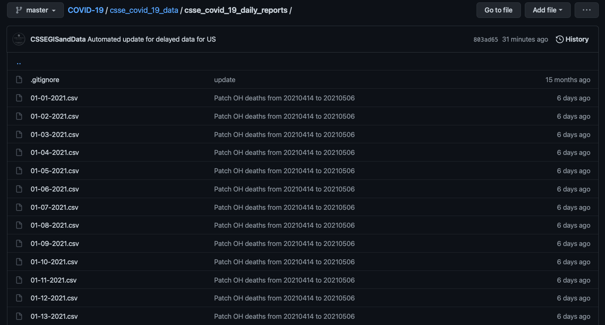
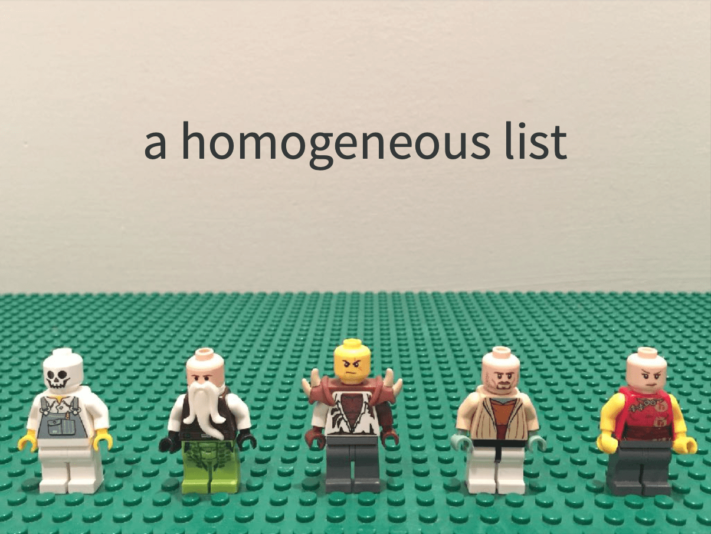
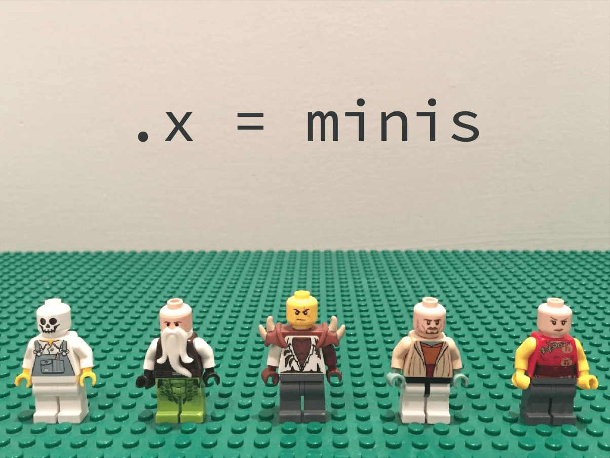
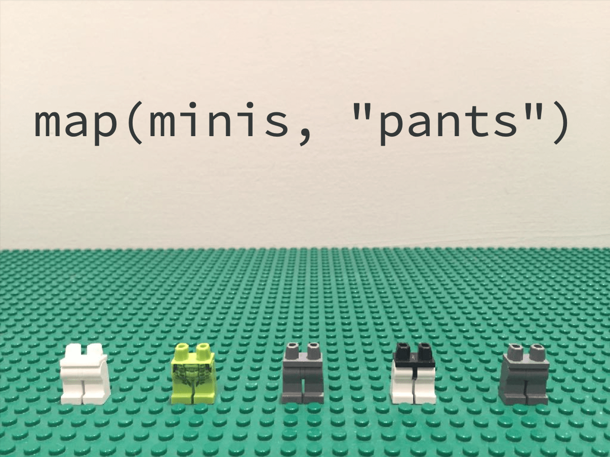

class: middle

```{r initial, echo = FALSE, cache = FALSE, results = 'hide'}
library(knitr)
options(htmltools.dir.version = FALSE, htmltools.preserve.raw = FALSE, 
  tibble.width = 60, tibble.print_min = 6)
opts_chunk$set(
  echo = TRUE, warning = FALSE, message = FALSE, comment = "#>",
  fig.path = 'figure/', cache.path = 'cache/', cache = TRUE, fig.retina = 3,
  fig.align = 'center', fig.width = 4.5, fig.height = 4, fig.show = 'hold',
  dpi = 120
)
```

```{r xaringan-panelset, echo = FALSE}
xaringanExtra::use_panelset()
```

```{r external, include = FALSE, cache = FALSE}
read_chunk('R/11-dry.R')
```


---

class: center

## Case study: batch download and process COVID-19 data

[](https://github.com/CSSEGISandData/COVID-19/tree/master/csse_covid_19_data/csse_covid_19_daily_reports)

---

## Keep calm, and import CSVs one by one

```{r covid-03}
```

---

## Data is changing

```{r covid-1231}
```

---

class: middle

## What are the repeated patterns?

1. everyday different URLs
2. read each csv file into R
3. non-standardised column names

## DRY: automate the common tasks above

---

## .large[.large[.brown[1]]] generate a sequence of urls 

```{r make-url}
```

.large[.brown[**3**]] key steps to creating a custom function:

1. pick a **name** for the function, e.g. `make_url`.
2. list the inputs, or **arguments**, to the function inside `function`, e.g. `date`.
3. place the code you have developed in **body** of the function, a `{` block that immediately follows `function(...)`.

---

## Test `make_url()`: does it return what we expected?

```{r test-make-url}
```

---

## .large[.large[.brown[2 & 3]]] read data and standardise column names

```{r read-covid19}
```

---

class: middle

## Why .brown[fun]ction

* Modularise the code to make it easier to understand the logic.
* Generalise the code to make it reusable later.
* Reduce the duplication and make it less error-prone.

---

class: inverse middle

## The joy of functional programming (FP)

.footnote[Hadley Wickham: The joy of functional programming [<i class="fab fa-youtube"></i>](https://www.youtube.com/watch?v=bzUmK0Y07ck)]

---

.left-column[
.center[[](https://purrr.tidyverse.org)]
## comes to rescue
]
.right-column[
## copy <i class="fas fa-copy"></i> and paste <i class="fas fa-paste"></i>

```{r read-covid19-hand, eval = FALSE}
```

When it's gonna end? `r emo::ji("sob")`
<hr>
The goal of FP is to make it easy to express repeated actions using high-level verbs.
]

???

introduce typos/errors, when just simply copy and paste

---

.left-column[
.center[[](https://purrr.tidyverse.org)]
### - `map()`
]
.right-column[
`map(.x, .f, ...)` for every element of .brown[`.x`], apply .brown[`.f`]
* always returns a list 
```{r map}
```
]

---

.left-column[
.center[[](https://purrr.tidyverse.org)]
### - `map()`
]
.right-column[
A **functional** is a function that takes a function as an input and returns a vector as output.

.center[]
]

---

.left-column[
.center[[](https://purrr.tidyverse.org)]
### - `map()`
]
.right-column[
`.f` takes a function, formula, or vector.
* If a **function**, it is used as is.
* If a **formula**, e.g. `~ .x + 2`, it is converted to a function. There are three ways to refer to the arguments:
  + For a single argument function, use `.`
  + For a two argument function, use `.x` and `.y`
  + For more arguments, use `..1`, `..2`, `..3` etc
* If a **character** vector index by name and a **numeric** vector index by position.

```{r map-lamda, eval = FALSE}
```
]

---

count: false

.left-column[
.center[[](https://purrr.tidyverse.org)]
### - `map()`
]
.right-column[
</img>
.footnote[image credit: Jenny Bryan]
]

---

count: false

.left-column[
.center[[](https://purrr.tidyverse.org)]
### - `map()`
]
.right-column[
</img>
</img>
.footnote[image credit: Jenny Bryan]
]

---

count: false

.left-column[
.center[[](https://purrr.tidyverse.org)]
### - `map()`
]
.right-column[
</img>
</img>
</img>
.footnote[image credit: Jenny Bryan]
]

---

.left-column[
.center[[](https://purrr.tidyverse.org)]
### - `map()`
]
.right-column[
## Bind multiple tibbles by row
```{r bind-rows, eval = FALSE}
```

```{r map-output, echo = FALSE}
covid19_raw <- read_rds("data/covid19-raw.rds") 
covid19_raw %>% select(-date)
```
]

---

.left-column[
.center[[](https://purrr.tidyverse.org)]
### - `map()`
]
.right-column[
## Hmm, where are the dates?
```{r bind-rows, eval = FALSE}
```

```{r ref.label = "map-output", echo = FALSE}
covid19_raw <- read_rds("data/covid19-raw.rds") 
covid19_raw %>% select(-date)
```
]

---

.left-column[
.center[[](https://purrr.tidyverse.org)]
### - `map()`
### - `map2()`
]
.right-column[
`map2(.x, .y, .f)` for every element of .brown[`.x`] and .brown[`.y`], apply .brown[`.f`]
```{r map2, eval = FALSE}
```

```{r map2-output, echo = FALSE}
covid19_raw %>% 
  mutate(date = mdy(date)) %>% 
  relocate(date, .after = last_col())
```
]

---

.left-column[
.center[[](https://purrr.tidyverse.org)]
### - `map()`
### - `map2()`
]
.right-column[
<br>
.center[]
]

---

.left-column[
.center[[](https://purrr.tidyverse.org)]
### - `map()`
### - `map2()`
### - `map_dfr()`
]
.right-column[
`map_*()` is a variant of `map()` that returns an output in the indicated type. `map_dfr()` returns data frames by row-binding.
```{r map-dfr, eval = FALSE}
```

```{r map-dfr-output, echo = FALSE}
covid19_raw
```
]

---

.left-column[
.center[[](https://purrr.tidyverse.org)]
### - `map()`
### - `map2()`
### - `map_dfr()`
### - `map_*()`
]
.right-column[
`map()` variants
* `map(.x, .f)` maps over 1 argument returns a list
* `map_dbl(.x, .f)` returns a double vector
* `map_chr(.x, .f)` returns a character vector
* `map_lgl(.x, .f)` returns a logical vector
* `map_dfr(.x, .f)` returns a data frame created by row-binding
* `map_dfc(.x, .f)` returns a data frame created by col-binding
<hr>
* `map2_*(.x, .y, .f)` maps over 2 arguments
* `pmap_*(.l, .f)` maps over > 2 arguments
]

---

background-image: url(https://github.com/allisonhorst/stats-illustrations/blob/master/rstats-blanks/across_blank.png?raw=true)
background-size: 100% 100%

class: inverse

---

.left-column[
.center[[](https://dplyr.tidyverse.org)]
]
.right-column[
## Wrangle a bit

```{r clean-country}
```
]

---

.left-column[
.center[[](https://dplyr.tidyverse.org)]
]
.right-column[
```{r manual-col}
```
Don't wanna type `r emo::ji("sob")`, but I typed...
]

---

## Apply a function .brown[`across()`] multiple columns

.pull-left[
```{r across, eval = FALSE}
```
]
.pull-right[
```{r across-where, eval = FALSE}
```
]

---

.left-column[
.center[[](https://dplyr.tidyverse.org)]
]
.right-column[
```{r covid19-byregion}
```
]

---

background-image:url(img/lst-col.png)
background-position: 90% 60%
background-size: 10%

.left-column[
.center[[](https://tidyr.tidyverse.org)]
]
.right-column[
`nest()` multiple columns into a .brown[list-column]
```{r covid19-nest}
```
]

---

.left-column[
.center[[](https://purrr.tidyverse.org)]
]
.right-column[
## Look inside the list-column
```{r covid19-au}
```
]

---

.left-column[
.center[[](https://purrr.tidyverse.org)]
]
.right-column[
## Fit regression models and extract slopes
```{r covid19-au-fit}
```
]

---

.left-column[
.center[[](https://purrr.tidyverse.org)]
]
.right-column[
## .brown[Fun]ction time

```{r extract-slope}
```

Oops, `map()` isn't happy. `r emo::ji("slightly_frowning_face")`

```{r map-slope, error = TRUE}
```
]

---

.left-column[
.center[[](https://purrr.tidyverse.org)]
]
.right-column[
If an error occured, `safely()` captures the error
* returns a named list of `result` and `error`
```{r safely-slope}
```
]

---

## Pull out results

.pull-left[
```{r safely-result-lst}
```
]
.pull-right[
```{r safely-result-dbl, eval = FALSE}
```

```{r safely-result-dbl2, echo = FALSE}
covid19_lstcol$data %>% 
  map(safely_extract_slope) %>% 
  map_dbl("result") %>% 
  print(width = 40)
```
]

---

## Alternatively, `mutate()` with `map()` inside a tibble

```{r mutate-map}
```

---

class: middle

## Side-effects

Most functions are called for the value that they return. But some functions are called primarily for their side-effects, for example:

* `print()` displays values/plots to the screen.
* `write_csv()` writes values to the CSV file saved in the disk.

No values/outputs to be captured.

<hr>

<i class="far fa-square"></i> We're going to save each region's data into separate CSV files to make it easier to import in the future.

---

.left-column[
.center[[](https://dplyr.tidyverse.org)]
]
.right-column[
## `group_split()` splits tibble into chunks
```{r group-split}
```
]

---

.left-column[
.center[[](https://purrr.tidyverse.org)]
]
.right-column[
## `walk()` with .brown[side-effects], if no outputs

```{r walk2, eval = FALSE}
```
<hr>
```{r dir-lst}
fs::dir_ls("data/covid19")
```
]

---

.left-column[
.center[[](https://purrr.tidyverse.org)]
]
.right-column[
[{fs}](https://fs.r-lib.org) provides a cross-platform, uniform interface to file system operations.
```{r map-dfr-disk}
```
]

---

## Reading

.pull-left[
.center[[](https://r4ds.had.co.nz)]
* [Functions](https://r4ds.had.co.nz/functions.html)
* [Iteration](https://r4ds.had.co.nz/iteration.html#the-map-functions)
]
.pull-right[
.center[[](https://adv-r.hadley.nz)]
* [Functionals](https://adv-r.hadley.nz/functionals.html)
]
